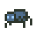
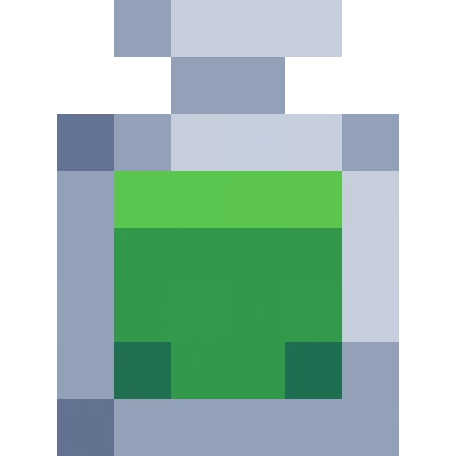
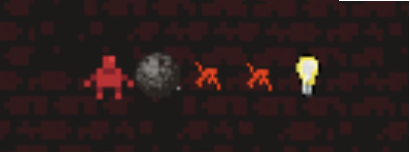
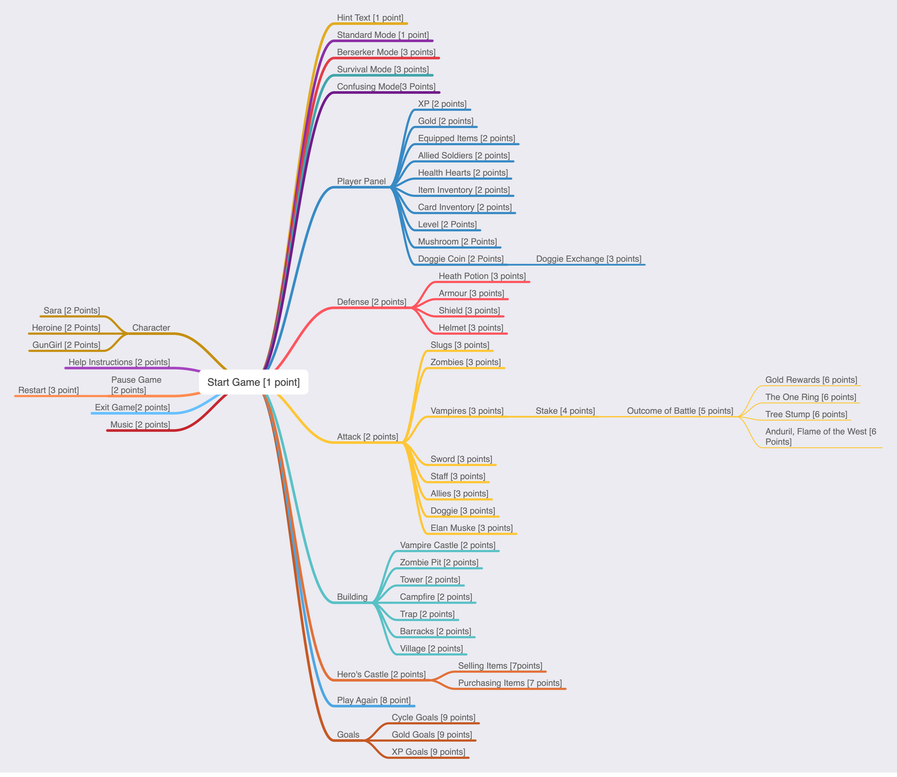

# COMP2511 Project: Dungeon Mania

## Contents

This specification is broken into four parts:
<ol type="i">
    <li><a href="#part-i-introduction">Introduction</li>
    <li><a href="#part-ii-product-specification">Product Specification</a></li>
    <li><a href="#part-iii-technical-specification">Technical Specification</a></li>
    <li><a href="#part-iv-assessment">Assessment</a></li>
</ol>

### Table of Contents

[[_TOC_]]

# Part I) Introduction

## 0. Changelog

- Tue 28 Jun 11:30am - Correct descriptions for `tick` overloads in interface, add note about keeping branches when squashing and fix formatting in link, add setup images
- Tue 28 Jun 6pm - Replace `gameMode` parameter with `configName` in new game method i.e. `newGame(String dungeonName, String configName)`
- Tue 28 Jun 8:00pm - Fix two battle calculation tests in `ExampleTests`
- Wed 29 Jun 9:30pm - Fix front-end config selector in starter code
- Thu 30 Jun 10:30pm - Add `player` to dungeon input entities
- Sat 2 Jul 12pm - Allies provide attack/defence bonuses
- Sat 2 Jul 12:30pm - Add coverage extraction
- Mon 4 Jul 9pm - Clarify square blast radius for bombs and mercenary bribing
- Mon 4 Jul 11pm - Nesting of compound goals
- Tue 5 Jul 7pm - Fix wording of complex goals in 3.7.2
- Tue 5 Jul 10pm - Fix provided config files for allies
- Mon 11 Jul 1pm - Fix `getEntitiesStream` in `TestUtils` to check prefixes instead of entire entity type
- Sun 10 Jul 9am - Fix confusing exception and add precondiction in the JavaDoc for `FileLoader.loadResourceFile()`
- Tue 12 Jul 4pm - Fix sample battle test to have positive delta instead of negative for health in `RoundResponse`
- Tue 12 Jul 6pm - Clarify `isInteractable` behaviour with allies, zombie toast spawner behaviour if there's no open square and removal of items from inventory
- Tue 12 Jul 8pm - If a spider is stuck between two boulders in its movement path, it should remain still
- Tue 12 Jul 10pm - Improve wording of effects of bows in battles
- Wed 13 Jul 9am - Fix the typo in the example battle test
- Thu 14 Jul 6am - Add image for green portal
- Thu 14 Jul 10pm - Fix triggering interactions multiple times from the front-end
- Sat 16 Jul 9am - Add error tolerant to battle calculation
- Mon 18 Jul 8am - Add Milestone 3 (search for 💀 to find all product/technical spec changes)
- Tue 19 Jul 9pm - Fix section 4.1.1 by adding boss entities
- Tue 19 Jul 10pm - Fix M3 spec Typos
- Wed 20 Jul 12am - Fix description for `midnight_armour_defence` and durability for midnight armour in the spec.
- Wed 20 Jul 6pm - Removed redundant `hydra_spawn_rate` config field from the spec because hydra will not spawn from a spawner.
- Wed 20 Jul 11pm - Fix description for `buildable` fields in `DungeonResponse`
- Wed 20 Jul 11pm - Fix description for building `midnight_armour`
- Thu 21 Jul 10pm - Clarify adjacent as being cardinally adjacent in description for logical entities
- Fri 22 Jul 8am - Remove stale `gameMode` parameter from `generateDungeon`
- Fri 22 Jul 3pm - Add rewind buttons for `time_turner` to frontend
- Fri 22 Jul 3pm - Add dungeon generation to frontend and fix method signature for `generateDungeon`
- Tue 26 Jul 5pm - Remove `switch_door` from logic images
- Fri 22 Jul 5pm - Clarify Sun Stone and Sceptre.
- Sat 23 Jul 12pm - Time travel clarifications
- Sat 23 Jul 9pm - Clarify dungeon generation and time travel behaviour
- Sun 24 Jul 9am - Fix description for exceptions in `interact()` and description for sun stone
- Sun 24 Jul 9pm - Clarify dungeon state after time travel
- Sun 24 Jul 11pm - Revert bad spec update and clarify `hydra_health_increase_rate`
- Tue 26 Jul 11pm - Clarify logical entity input
- Wed 27 Jul 8am - (Important) Update exit location of player out of time portal
- Thu 28 Jul 9am - Clarify time turner vs time portal travelling back

## 1. Aims

* Apply software design principles and patterns to create well-maintained software solutions
* Synthesise and adapt to changes in requirements
* Practice software design and development in a dynamic team environment using Agile principles
* Work with the Java Programming Language and Java Class Libraries
* Build medium-scale persistent web applications from scratch
* Appreciate issues in the design and development of software

## 2. Overview

For many years, Penguin Pty Ltd (a small software business run by Atilla Brungs) has dominated the native application gaming market with hit games. However in recent years, advancements in web technologies mean that the new generation of consumers don't want to download and run a native application, but instead want to play games online. To adapt to the ever-changing market, Penguin Pty Ltd has decided to take users back to the 1980s and develop a new game called *Dungeon Mania*, but with a modern twist - designed as a web application.

Penguin Pty Ltd has sub-contracted two software firms:

* BlueBottle Pty Ltd to develop a web-based frontend to the game
* YourTeam Pty Ltd (a team of talented misfits completing COMP2511 in 22T2), who will build the backend Java application.

Furthermore, there is a rival company called Spheniscidae Pty Ltd which has already produced a solution which you can refer to as a possible sample solution. 

# Part II) Product Specification

## 3. Rules of the Game

In Dungeon Mania you control a Player and have to complete various goals within a series of dungeons to complete the game!

The simplest form of such a puzzle is a maze, where the Player must find their way from the starting point to the exit.


More advanced puzzles may contain things like boulders that need to be pushed onto floor switches,


enemies that need to be fought with weapons, or collectables like potions and treasure.


### 3.1 Player

The Player, can be moved up, down, left and right into cardinally adjacent squares, provided another entity doesn't stop them (e.g. a wall). The Player begins the game with a set amount of health and attack damage. The Player spawns at a set 'entry location' at the beginning of a game.

### 3.2 Static Entities

The game contains the following static entities. 

| Entity    | Image | Description   |
| --------- | ----- | -----------   |
| Wall      |  | Blocks the movement of the Player, enemies and boulders.   |
| Exit      |  | If the Player goes through it, the puzzle is complete. |
| Boulder   |  | Acts like a wall in most cases. The only difference is that it can be pushed by the Player into cardinally adjacent squares. The Player is only strong enough to push <b>one</b> boulder at a time. When the player pushes a boulder, they move into the spot the boulder was previously in. Boulders can be pushed onto collectable entities. |
| Floor Switch |   | Switches behave like empty squares, so other entities can appear on top of them. When a boulder is pushed onto a floor switch, it is triggered. Pushing a boulder off the floor switch untriggers. |
| Door      |  | Exists in conjunction with a single key that can open it. If the Player holds the key, they can open the door by moving through it. Once open, it remains open. |
| Portal       |  | Teleports entities to a corresponding portal. The player must end up in a square cardinally adjacent to the corresponding portal. The square they teleport onto must also be within movement constraints - e.g. the player cannot teleport and end up on a wall. If all squares cardinally adjacent to the corresponding portal are walls, then the player should remain where they are. |
| Zombie Toast Spawner |  | Spawns zombie toasts in an open square cardinally adjacent to the spawner. The Player can destroy a zombie spawner if they have a weapon and are cardinally adjacent to the spawner. If all the cardinally adjacent cells to the spawner are walls, then the spawner will not spawn any zombies. |

### 3.3 Moving Entities

In addition to the Player, the game contains the following moving entities. 

All enemy entities can be created as part of the initial dungeon. Each tick, all enemies move according to their respective behaviour. 

| Entity    | Image | Description |
| --------- | ----- | ----------- |
Spider |  | Spiders spawn at random locations in the dungeon from the beginning of the game. When the spider spawns, they immediately move the 1 square upwards (towards the top of the screen) and then begin 'circling' their spawn spot (see a [visual example here](images/spider_movement_1.png)). Spiders are able to traverse through walls, doors, switches, portals, exits (which have no effect), but not boulders, in which case it will reverse direction (see a [visual example here](images/spider_movement_2.png)). When it comes to spawning spiders, since the map is technically infinite you can spawn them anywhere - however for better gameplay we suggest you make an assumption and pick a four co-ordinate box to spawn spiders in. If a spider is stuck between two boulders in its movement path, it should remain still. |
| Zombie Toast  |  | Zombies spawn at zombie spawners and move in random directions. Zombies are limited by the same movement constraints as the Player, except portals have no effect on them. |
| Mercenary |  | Mercenaries do not spawn; they are only present if created as part of the dungeon. They constantly move towards the Player, stopping only if they cannot move any closer (they are able to move around walls). Mercenaries are limited by the same movement constraints as the Player. All mercenaries are considered hostile, unless the Player can bribe them with a certain amount of gold; in which case they become allies. Mercenaries must be within a certain radius of the player in order to be bribed, which is formed by the diagonally and cardinally adjacent cells in a "square" fashion, akin to the blast radius for bombs. As an ally, once it reaches the Player it simply follows the Player around, occupying the square the player was previously in. |

### 3.3.1 Bosses 💀

Bosses are moving entities which are harder to defeat/conquer than normal enemies.

| Entity    | Image         | Description |
| --------- | --------------| ------------|
| Assassin |  | Assassins are exceptionally powerful mercenaries which deal significantly more damage. When bribing an Assassin, there is a certain chance that the bribe will fail; the gold will be wasted and the Assassin will remain hostile. Assassins are also capable of seeing and moving towards the Player when they are invisible, if they are within a certain radius.  |
| Hydra |  | Hydras are generally considered to be a special creatures similar to Zombies. Hydras are limited by the same movement constraints as Zombies. When a hydra is attacked by the player, there is a certain chance that its health will increase rather than decrease by the given amount, [as two heads have grown back when one is cut off](https://simple.wikipedia.org/wiki/Lernaean_Hydra). |

### 3.4 Collectable Entities

| Entity    | Image | Description |
| --------- | ----- | ----------- |
| Treasure       |  | Can be collected by the Player. | 
| Key            |  | Can be picked up by the player when they move into the square containing it. The Player can carry only one key at a time, and only one door has a lock that fits the key. Keys disappear once used in any context i.e. opening a door, building an item. If a key is used before opening its door, its corresponding door will be locked forever. | 
| Invincibility Potion |  | When a Player picks up an Invincibility potion, they may consume it at any time. Any battles that occur when the Player has the effects of the potion end immediately after the first round, with the Player immediately winning. Because of this, Mercenaries and Zombies will run away from the Player when they are invincible. Movement of spiders and bribed mercenaries remains unaffected. The effects of the potion only last for a limited time.         |
| Invisibility Potion | | When a player picks up an invisibility potion, they may consume it at any time and they immediately become invisible and can move past all other entities undetected. Battles do not occur when a player is under the influence of an invisibility potion. Since mercenaries typically follow the player, their movement becomes the same as a Zombie when the player is invisible. |
| Wood       |  | Can be collected by the player.  |
| Arrows     |  | Can be picked up by the player.  |
| Bomb       |  | Can be collected by the player. When removed from the inventory it is placed on the map at the player's location. When a bomb is cardinally adjacent to an active switch, it destroys all entities in diagonally and cardinally adjacent cells, except for the player, forming a "square" blast radius. The bomb should detonate when it is placed next to an already active switch, or placed next to an inactive switch that then becomes active. The bomb explodes on the same tick it becomes cardinally adjacent to an active switch. A bomb cannot be picked up once it has been used. |
| Sword  |  | A standard melee weapon. Swords can be collected by the Player and used in battles, increasing the amount of damage they deal by an additive factor. Each sword has a specific durability that dictates the number of battles it can be used before it deteriorates and is no longer usable.  |

It is possible for a player to use another potion while the effects of an existing potion are still lasting (can be of the same or a different type of potion). In this case, the effects are not registered immediately but are instead 'queued' and will take place the tick following the previous potion wearing of. For example, on tick 0 the Player consumes an invinsibility potion that lasts for 5 ticks and becomes invisible to enemies moving that tick, on tick 3 they use an invincibility potion, at the end of tick 4 (after all enemy movements) the player becomes visible again and becomes invincible.

### 3.4.1 Further Collectable Entities 💀

In Milestone 3, the following collectable entities have been added:

| Entity    | Image         | Description |
| --------- | --------------| ------------|
| Sun Stone |  | A special form of treasure, hard and treasuable. It can be picked up by the player. Can be used to open doors, and can be used interchangeably with treasure or keys when building entities. But it cannot be used to bribe mercenaries or assassins. Since it is classed as treasure it counts towards the treasure goal. When used for opening doors, or when replacing another material such as a key or treasure in building entities, it is retained after use. |

### 3.5 Buildable Entities

Some entities can be built using a 'recipe' by the player, where entities are combined to form more complex and useful entities. Once a buildable item has been constructed, it is stored in a player's inventory. For all buildable entities, once the item is constructed the materials used in that construction have been consumed and disappear from the player's inventory. 

| Entity    | Image         | Description       |
| --------- | --------------| ------------------|
| Bow  | | Can be crafted with 1 wood + 3 arrows. The bow has a durability which deteriorates after a certain number of battles. Bows give the Player double damage in each round, to simulate being able to attack an enemy at range (it can't actually attack an enemy at range). |
| Shield    |  | Can be crafted with 2 wood + (1 treasure OR 1 key). Shields decrease the effect of enemy attacks. Each shield has a specific durability that dictates the number of battles it can be used before it deteriorates. |

### 3.5.1 Further Buildable Entities 💀

In Milestone 3, the following buildable entities have been added:

| Entity    | Image         | Description |
| --------- | --------------| ------------|
| Sceptre   |  | Can be crafted with (1 wood OR 2 arrows) + (1 key OR 1 treasure) + (1 sun stone). A character with a sceptre does not need to bribe mercenaries or assassins to become allies, as they can use the sceptre to control their minds without any distance constraint. But the effects only last for a certain number of ticks. |
| Midnight Armour |  | Can be crafted with (1 sword + 1 sun stone) if there are no zombies currently in the dungeon. Midnight armour provides extra attack damage as well as protection, and it lasts forever. |

### 3.6 Battles

A battle takes place when the Player and an enemy are in the same cell at any point within a single tick. The conditions for a battle occurring are the same regardless of whether the player moves onto the same tile as the enemy, or vice versa.

A 'round' of a battle occurs as follows:

```
Player Health = Player Health - (Enemy Attack Damage / 10)
Enemy Health = Enemy Health - (Player Attack Damage / 5)
```

If the Player's health is <= 0, then the Player dies, is removed from the game and the game is over. If the enemy's health is <= 0, then the enemy dies and is removed from the game. If after the above 'round', neither the Player nor the enemy is dead, the round repeats until either the Player or enemy is dead.

In battles, allies provide an attack and defence bonus to the player.

### 3.6.1 Weapons in Battle

An example of a bow, sword and shield being used in battle is as follows:

```
player health = 10
player base attack damage = 5
bow attack damage = 2
sword attack damage = 1
shield defence = 2
enemy health = 10
enemy attack damage = 5

Battle occurs:
- Round 1   enemy health    = 10 - ((2 * (5 + 1)) / 5)  = 7.6
            player health   = 10 - ((5 - 2) / 10)       = 9.7
- Round 2   enemy health    = 7.6 - ((2 * (5 + 1)) / 5) = 5.2
            player health   = 9.7 - ((5 - 2) / 10)      = 9.4
- Round 3   ...
```

All additive/reductive bonuses from weapons are processed before multiplicative bonuses.

### 3.7 Goals

In addition to its layout, each dungeon also has a goal that defines what must be achieved by the player for the dungeon to be considered complete. Basic goals are:

* Getting to an exit;
* Destroying a certain number of enemies (or more) AND all spawners;
* Having a boulder on all floor switches;
* Collecting a certain number of treasure items (or more); 

Goals are only evaluated after the first tick. If getting to an exit is one of a conjunction of conditions, it must be done last. For example, if the condition is to destroy all enemies AND get to an exit, the player must destroy the enemies THEN get to the exit. 

#### 3.7.2 Complex Goals

More complex goals can be built by logically composing goals. For example:

* Destroying a certain number of enemies and spawners AND getting to an exit
* Collecting a certain number of treasure OR having a boulder on all floor switches
* Getting to an exit AND (destroying all enemies OR collecting all treasure)

All compound goals are binary (they contain two and only two subgoals).

If getting to an exit is one of a conjunction of conditions, it must be done last. For example, if the condition is to collect 3 treasure AND get to an exit, the player must collect at least 3 treasures THEN get to the exit. It is possible for a subgoal to become un-achieved, for example if the dungeon goal is `boulders AND exit` and all boulders are pushed onto switches, then the boulders subgoal becomes complete. However, if a boulder is then moved off a switch, the boulders subgoal is no longer complete.

### 3.8 Winning & Losing

The game is won when all the goals are achieved. The game is lost when the player dies and is removed from the map.

### 3.9 Advanced Movement 💀

During the development process the engineering team discovered issues in the requirements of the movement of mercenaries and decided that they should follow a specific path to move towards the player.

In this Milestone, the movement of mercenaries (and by extension assassins) must follow a Djikstra's algorithm to take the shortest path towards the player.

<details>
<summary>
You can view pseudocode for the algorithm here.
</summary>

> Note: This is not necessarily optimal (A* is probably a better algorithm for our common maze like dungeons), but since this is a design course and not an algorithms course, this is fine.

```
function Dijkstras(grid, source):
    let dist be a Map<Position, Double>
    let prev be a Map<Position, Position>

    for each Position p in grid:
        dist[p] := infinity
        previous[p] := null
    dist[source] := 0

    let queue be a Queue<Position> of every position in grid
    while queue is not empty:
        u := next node in queue with the smallest dist
        for each cardinal neighbour v of u:
            if dist[u] + cost(u, v) < dist[v]:
                dist[v] := dist[u] + cost(u, v)
                previous[v] := u
    return previous
```

</details>

As part of this, you will need to extend your solution to accomodate the idea of a **swamp tile**. These are tiles that have an `x` and `y` position and remain fixed throughout the entire game. They slow the movement of all entities through them, except for the player. Each swamp file has a movement factor which is a multiplying factor of the number of ticks it takes to traverse the tile. For example, let us say the movement factor for a swamp tile is 2:
* Tick 1: Move onto the swamp tile;
* Tick 2: Stuck on the swamp tile;
* Tick 3: Still stuck on the swamp tile;
* Tick 4: Move off the swamp tile.

| Entity    | Image         | 
| --------- | --------------|
| Swamp Tile |  |

Your implementation of Djikstra's will need to accomodate for the fact that swamp tiles slow the enemies down. There will be one autotest that checks that portals have an effect on your implementation of Djikstra's.

### 3.10 Persistence 💀

At any point during the game, the game should be able to be saved into a local persistence layer such that if the application is terminated, the user can reboot the application, select the game from a list of saved games and continue playing from where they left off, as if nothing had changed at all.

To pass the more basic tests, you will simply need to preserve the position of entities on the map. To pass more complex ones, you will need to consider persistence of items like potions, bribing/mind-control, etc.

### 3.11 Extension 1: Time Travel 💀

#### 3.11.1 Time Turner

This part of the extension includes the following new entity:

| Entity    | Image         |
| --------- | --------------|
| Time Turner |  |

If the player has collected a time turner, then two rewind buttons will appear on the frontend. When clicked, these buttons move the state of the game back one tick and 5 ticks respectively and "transport" the current player back to those game states in a time travelling fashion.

#### 3.11.2 Time Travelling Portal

This part of the extension includes the following new entity:

| Entity    | Image         |
| --------- | --------------|
| Time Travelling Portal |  |

If a player travels through a time travelling portal, they end up on the same square as the portal, except the dungeon state is that of 30 ticks previously. If less than 30 ticks have passed, then the dungeon state is simply the initial dungeon state.

#### 3.11.3 Time Travel Rules

When a character has time travelled, either by the rewind buttons or via a time travelling portal:

* Their 'older self' still exists in the dungeon as its own entity. If they encounter their older self and **either** are carrying a sun stone or are wearing midnight armour, or they are invisible, then nothing happens. If not, then a battle ensues.
* Their 'older self' should take the same path as was taken initially, and unless they encounter their 'current self' (they character being controlled), should eventually travel through the time portal and disappear from the map.
* The player's inventory persists across time travelling. This means that if a player picks up a sword then travels through a time portal, the sword remains in their inventory as well as being back on the map available to pick up.

Only the character can travel through time travel portals.

The older player should still collect items and play out all `tick` and `interact` movements with those items as they did before. Time travel takes the player to *after* the tick takes place, e.g. if on tick 30 the player travels through a portal it arrives out of the other side after tick 0 has taken place. Note that for time turners, this isn't the same as `rewind` operations do not class as a `tick`.

<details>
<summary>
Implementation Hint
</summary>

The design of this extension is up to you, however we recommend you treat time travel as moving backwards in a series of game states that are being stored (the state of the dungeon at tick X). When time travel occurs, the player is transported to that state, and all `tick` and `interact` functions are "played" out in the same order *for the older player*, not the current player.

This also means that when the older player reaches the tick during which they time travelled (either by using a time turner or through a portal), they should be removed from the map.

</details>

### 3.12 Extension 2: Dungeon Builder 💀

In this extension, instead of specifying an existing dungeon to play, players can choose specify a dungeon to be automatically generated when creating a new game.

As part of this, you will need to be able to automatically generate dungeons.  Furthermore it's important that you have an *exit* at the end position and that you have exit goals setup for this created dungeon.

#### 3.12.1 Generating a Dungeon - Randomized Prim's Algorithm

<details>
<summary>
You will need to generate dungeons according to the following maze generation algorithm (which is just a randomised version of Prim's).
</summary>

> Note: You should enforce a border of walls around the maze.

```
function RandomizedPrims(width, height, start, end):
    let maze be a 2D array of booleans (of size width and height) default false
    // false representing a wall and true representing empty space

    maze[start] = empty

    let options be a list of positions
    add to options all neighbours of 'start' not on boundary that are of distance 2 away and are walls

    while options is not empty:
        let next = remove random from options

        let neighbours = each neighbour of distance 2 from next not on boundary that are empty
        if neighbours is not empty:
            let neighbour = random from neighbours
            maze[ next ] = empty (i.e. true)
            maze[ position inbetween next and neighbour ] = empty (i.e. true)
            maze[ neighbour ] = empty (i.e. true)

        add to options all neighbours of 'next' not on boundary that are of distance 2 away and are walls
    
    // at the end there is still a case where our end position isn't connected to the map
    // we don't necessarily need this, you can just keep randomly generating maps (was original intention)
    // but this will make it consistently have a pathway between the two.
    if maze[end] is a wall:
        maze[end] = empty

        let neighbours = neighbours not on boundary of distance 1 from maze[end]
        if there are no cells in neighbours that are empty:
            // let's connect it to the grid
            let neighbour = random from neighbours
            maze[neighbour] = empty
```

Or, in a more wordy fashion;

- Given a grid that consists of a 2D array of states (Wall/Empty) initialised to only walls
- Set the start position to empty spaces
- Add to a list of positions to process the neighbours of start (that are walls)
- Given that there are still positions to process:
    - Pick a random position from the list and a random cardinal neighbour of distance 2 that isn't on the boundary and is empty (not a wall)
    - Pick a random neighbour that is a wall and connect the two via 2 empty spaces
    - Compute all cardinal positions that are walls for the random neighbour and add it to the list of positions to process.
- At the end fix-up the maze given that the end cell is still a wall
    - Mark it as not a wall
    - If it has atleast one neighbour that is a empty cell then don't do anything else (it's connected)
    - Otherwise, mark one of it's cardinal neighbours as a empty cell as well.
</details>

### 3.13 Extension 3: Logic Switches 💀

There are two new entities in this extension:

| Entity      | Image                                                       | Description                                                                                                                                                           |
|-------------|-------------------------------------------------------------|-----------------------------------------------------------------------------------------------------------------------------------------------------------------------|
| Light Bulb  |                           | Light bulbs cannot be collected, but can be lit up by placing a boulder on an cardinally adjacent switch. Light bulbs will always be created off.                               |
| Wire        |         | Wires cannot be collected, but form part of a circuit and are connected to a switch and any entity that interacts via switches.                                       |
| Switch Door |  | Switch doors can be opened without a key if connected to an active switch/circuit. It should only remain open as long as it is connected to an active switch/circuit. |

All entities which interact via switches (doors, bombs, and light bulbs), as well as switches themselves can become "logical" entities, where one of the following rules is adopted:

* AND - the entity will be only activated if there are 2 or more cardinally adjacent activated entities (switches with boulders on them or active wires). If there are more than two switches adjacent, all must be activated.
* OR - the entity will be activated if there are 1 or more cardinally adjacent activated entities
* XOR - the entity will be activated if there is 1 and only 1 cardinally adjacent activated entity
* CO_AND - the entity will only be activated if there are 2 or more activated entities cardinally adjacent, which are **both activated on the same tick** (i.e. a boulder is pushed onto them at the same time).

If a switch cardinally adjacent to a wire is activated, all the other interactable entities cardinally adjacent to the wire are activated. This allows for the creation of dungeons with logic gates. For example:

<table>
<tr>
<td>

</td>
<td>

</td>
</tr>
</table>

# Part III) Technical Specification

[You can find setting up instructions here](SETUP.md).

## 4. Dungeon Maps

Dungeon maps consist of JSON files which contain the following:
* `entities`, an array of entities in the map when the game starts; and
* `goal-condition`, a specification of the goals for winning the dungeon.

There will be no other fields present in the JSON.

All maps are infinite in all directions. Moving left/right is a decrease/increase in the x co-ordinate of an entity respectively, moving up/down is a decrease/increase in the y co-ordinate of an entity respectively.

### 4.1 Input Specification - Entities

Each entry in the `entities` JSON Array will be a JSON Object with the following fields:
* `x` - the x-position of the entity in the dungeon when the game starts;
* `y` - the y-position of the entity in the dungeon when the game starts; and
* `type` - the type of the entity.

The `type` field will be a string that starts with one of the following prefixes. For automarking purposes, all entities passed in will have a type in the following table. 

| Entity | JSON Prefix | Creatable in Dungeon Map? |
| ------ | ----------- | ------------------------- |
| Player    | <code>player</code> | Yes |
| Wall      | <code>wall</code> | Yes |
| Exit      | <code>exit</code> | Yes |
| Boulder   | <code>boulder</code> | Yes |
| Floor Switch | <code>switch</code> | Yes |
| Door      | <code>door</code> | Yes | 
| Portal       | <code>portal</code> | Yes |
| Zombie Toast Spawner | <code>zombie_toast_spawner</code> | Yes |
| Spider    | <code>spider</code>   | Yes |
| Zombie Toast | <code>zombie_toast</code>   | Yes |
| Mercenary | <code>mercenary</code> | Yes |
| Treasure      | <code>treasure</code> | Yes |
| Key           | <code>key</code> | Yes |
| Invincibility Potion | <code>invincibility_potion</code> | Yes |
| Invisibility Potion | <code>invisibility_potion</code> | Yes |
| Wood      | <code>wood</code> | Yes |
| Arrows    | <code>arrow</code> | Yes |
| Bomb      | <code>bomb</code> | Yes |
| Sword | <code>sword</code> | Yes |
| Bow  | <code>bow</code> | No, since this entity must be built by the player. |
| Shield    | <code>shield</code> | No, since this entity must be built by the player. |

#### 4.1.1 Further Entities 💀

| Entity | JSON Prefix | Creatable in Dungeon Map? |
| ------ | ----------- | ------------------------- |
| Assassin | <code>assassin</code> | Yes |
| Hydra | <code>hydra</code> | Yes |
| Swamp Tile    | <code>swamp_tile</code> | Yes |
| Sun Stone    | <code>sun_stone</code> | Yes |
| Sceptre    | <code>sceptre</code> | No, since this entity must be built by the player. |
| Midnight Armour    | <code>midnight_armour</code> | No, since this entity must be built by the player. |
| Time Turner    | <code>time_turner</code> | Yes |
| Time Travelling Portal    | <code>time_travelling_portal</code> | Yes |
| Light Bulb (off)    | <code>light_bulb_off</code> | Yes |
| Light Bulb (on)    | <code>light_bulb_on</code> | No, since light bulbs will always be created off. |
| Wire    | <code>wire</code> | Yes |
| Switch Door    | <code>switch_door</code> | Yes |
| Older Player    | <code>older_player</code> | No, since these will only appear when the player has time travelled. |

#### 4.1.2 Extra Fields

Some entities will contain additional fields in their JSON entry, namely:
- All entities of type `portal` will have a field `colour`. Two portals which have the same `colour` are linked (travelling through one portal takes you to the other). We will never provide a dungeon which has more than two portals of the same colour, and all portals will have a counterpart of the same colour in the dungeon. 
- All entities of type `door` and `key` will have a `key` field which, in the case of the `key` is the identifier of the key, and in the case of the `door` the id of the key which fits that door. 

#### 4.1.3 Further Extra Fields 💀

- All logical entities will be created with the field `logic` which will be one of `and`, `or`, `xor`, or `co_and`. Milestone 2 entities (bombs, switches) that do not have a logic field cannot be activated by wires and act as they did in Milestone 2. Milestone 3 logical entities (light bulbs, switch doors) will always be created with a logic field. Regular doors will never be created with a logic field.
- All swamp tiles will be created with a field `movement_factor` which will be the tile's movement factor, an integer >= 0.
- Switch doors will also have keys.

### 4.2 Input - Goals

A basic goal is represented in the dungeon as:

```javascript
"goal-condition": {
    "goal": <goal>
}
```

Where `<goal>` is one of `"enemies"`, `"boulders"`, `"treasure"` or `"exit"`.

A complex goal is represented in the dungeon as:

```javascript
"goal-condition": {
    "goal": <supergoal>,
    "subgoals": [
        {"goal": <goal>},
        {"goal": <goal>}
    ]
}
```

Where `<goal>` is one of `"enemies"`, `"boulders"`, `"treasure"`, `"exit"`, or another nested goal conjunction/disjunction itself, and `<supergoal>` is one of `"AND"` or `"OR"`.

## 5. Configuration Files

In `config_template.json` we have specified the template for a configuration file. This file is important as it specifies internal game mechanics which will affect the external behaviour of your application. Rather than hard coding these constants into your classes, you must instead read in these values from the specified file when the game is created. 

During automarking, we will be providing our own configuration files with each test dungeon - this allows our tests to set parameters that should ensure behaviours are produced without ambiguity. For this reason, if you do not read in the values correctly, you will likely fail a large number of our autotests.

| JSON Format                     | Description                                                                                                                                  |
|---------------------------------|----------------------------------------------------------------------------------------------------------------------------------------------|
| `ally_attack`                  | Attack bonus each ally gives to the player.                                                                                                  |
| `ally_defence`                  | Reduction in effect of enemy attack damage each ally gives to the player.                                                                                                  |
| `bribe_radius`                  | Radius in which a mercenary can be bribed.                                                                                                   |
| `bribe_amount`                  | Amount of gold required to bribe a mercenary.                                                                                                |
| `bomb_radius`                   | Blast radius of bomb.                                                                                                                        |
| `bow_durability`                | The number of battles that the bow lasts for.                                                                                                |
| `player_health`              | Health of the character.                                                                                                                        |
| `player_attack`              | Attack damage of the character.                                                                                                                 |
| `enemy_goal`                    | At least x enemies must be killed to complete the enemy goal                                                                                 |
| `invincibility_potion_duration` | The effects of the potion only last for x ticks.                                                                                             |
| `invisibility_potion_duration`  | The effects of the potion only last for x ticks.                                                                                             |
| `mercenary_attack`              | Attack damage of the mercenary.                                                                                                              |
| `mercenary_health`              | Health of the mercenary.                                                                                                                     |
| `spider_attack`                 | Attack damage of the spider.                                                                                                                 |
| `spider_health`                 | Health of the spider.                                                                                                                        |
| `spider_spawn_rate`             | Spiders spawn every x ticks, starting from the x'th tick. Spawn rate of 0 means that spiders will never spawn in the game.                   |
| `shield_durability`             | The number of battles that the shield lasts for.                                                                                             |
| `shield_defence`                | The reduction in the effect of the attack damage of the enemy as a result of the shield.                                                     |
| `sword_attack`                  | Amount of damage added to a players' attack damage when they use a sword in battle.                                                                                                |
| `sword_durability`                | The number of battles that the sword lasts for.   |
| `treasure_goal`                 | At least x treasure must be collected to complete the treasure goal                                                                          |
| `zombie_attack`                 | Attack damage of the zombie toast.                                                                                                           |
| `zombie_health`                 | Health of the zombie toast.                                                                                                                  |
| `zombie_spawn_rate`             | Zombies spawn every x ticks from each spawner, starting from the x'th tick. Spawn rate of 0 means that zombies will never spawn in the game. |

#### 5.1.1 Further Configuration Values 💀

In Milestone 3, the following configuration fields have been added.

| JSON Format | Description | 
| ------ | ----------- | 
| `assassin_attack`              | Attack damage of the assassin. |
| `assassin_bribe_amount`        | The amount of gold required to perform an attampt to bribe an assassin. |
| `assassin_bribe_fail_rate`     | The chance that the bribe on an assassin will fail. The value of this field should be always inclusively between 0 and 1. |
| `assassin_health`              | Health of the assassin. |
| `assassin_recon_radius`        | The radius within which an assassin can see and move towards the player even when they are invisible. |
| `hydra_attack`                 | Attack damage of the hydra. |
| `hydra_health`                 | Health of the hydra. |
| `hydra_health_increase_rate`   | The chance that the health of a Hydra increases when it gets attacked each round. The value of this field should be always inclusively between 0 and 1. |
| `hydra_health_increase_amount` | The increment on the health of a Hydra increases when it gets attacked. |
| `mind_control_duration`        | The amount of time mind controlling via a sceptre lasts for. |
| `midnight_armour_attack`       | Attack bonus wearing midnight armour gives to the player. |
| `midnight_armour_defence`      | Defence bonus wearing midnight armour gives to the player. |

#### 5.1.2 Backwards Compatiblity

All of the Milestone 2 configuration files (in the provided config files, and in our autotests) do not currently contain the fields listed in Section 4.1.2. Rather than retroactively adding these fields to the existing configuraiton files, you will need to design your implementation to accomodate for this and maintain **backwards compatibility**. All Milestone 3 configuration files will contain all values from both Milestones.

## 6. Interface

The layer of abstraction is at the level of the controller. In the starter code, we have provided a class `DungeonManiaController`.

The controller methods interact with a HTTP layer in the form of a web server, which we have written for you.

### 6.1 Interface Data Types

We have provided the following interface data types for you inside `response/models`. Similarly as for the assignment, you will need to create objects of these types for the controller to return and communicate information to the server layer.

In case you are interested, The server layer then wraps these objects inside a `GenericResponseWrapper`, a generic type we have made for you, and converts these objects to JSON using a libary called `gson` to allow them to be communicated to the frontend via a HTTP response.

<table>
<tr>
<th>Constructor Prototype</th>
<th>Description</th>
<tr>
<td>

```java
public DungeonResponse(String dungeonId,
                       String dungeonName,
                       List<EntityResponse> entities,
                       List<ItemResponse> inventory,
                       List<BattleResponse> battles,
                       List<String> buildables,
                       String goals)
```

</td>
<td>

<ul>
    <li><code>dungeonId</code> is the unique identifier for the dungeon</li>
    <li><code>dungeonName</code> is the name of the dungeon map being used (i.e. <code>maze</code>, which corresponds to the file <code>src/main/resources/dungeons/maze.json</code></li>
    <li><code>entities</code> is a list of all entities currently in the dungeon (all entities in the Player's inventory aren't included); if a Player or enemy dies it is removed from this list</li>
    <li><code>inventory</code> is the Player's current inventory</li>
    <li><code>buildables</code> is a list of buildable item types that the player can build, given their current inventory and game state</li>
    <li><code>battles</code> is the list of battles that has occured in total in the game so far (see <code>BattleResponse</code>), in the order that they occurred</li>
    <li><code>goals</code> is a string containing the goals yet to be completed. An empty string denotes the game has been won. Each goal in the string is preceded with a colon <code>:</code> and is one of the four basic goals listed in Section 4.2. How you represent conjunctions (AND) and disjunuctions (OR) is up to you, as the frontend will simply render your string with the goals as images. We will only check for the goal strings in our tests (e.g. <code>:exit</code>). An example of the <code>goals</code> string is <code>":exit AND (:treasure OR :enemies)"</code></li>
</ul>

</td>

<tr>
<td>

```java
public BattleResponse(String enemy,
                       List<RoundResponse> rounds,
                       double initialPlayerHealth,
                       double initialEnemyHealth)
```

</td>
<td>
<ul>
    <li><code>enemy</code> is the type of enemy (e.g. spider), <code>rounds</code> represent the rounds of the battle (see RoundResponse).</li>
    <li><code>initialPlayerHealth</code> is the initial health of the player before the battle</li>
    <li>initialEnemyHealth</code> is the initial health of the enemy before the battle.</li>
</td>

<tr>
<td>

```java
public RoundResponse(double deltaPlayerHealth,
                       double deltaEnemyHealth,
                       List<ItemResponse> weaponryUsed)
```

</td>
<td>
<ul>
    <li><code>deltaPlayerHealth</code> is the change in health of the character in that round of the battle (e.g. -3 is a reduction of 3 in health)</li>
    <li><code>deltaEnemyHealth</code> is the corresponding change of health of the enemy in that round of the battle. Note that each of these deltas can be positive and that the 'sign' of the health matters (e.g. positive deltas correlate to increase and negative deltas correlated to decrease in health).</li>
    <li><code>weaponryUsed</code> is a list of all attack and defence items used in the round, including potions.</li>
</ul>
</td>

<tr>
<td>

```java
public EntityResponse(String id,
                      String type,
                      Position position,
                      boolean isInteractable)
```

</td>
<td>
<ul>
    <li><code>id</code> is the unique identifier for the respective entity</li>
    <li><code>type</code> is the type of the entity (a prefix corresponding to the table in Section 4.1)</li>
    <li><code>position</code> is the x, y, z (layer) position of the entity</li>
    <li><code>isInteractable</code> refers to if the entity can receive interaction updates from frontend, which only pertains to mercenaries and zombie toast spawners. When mercenaries become allies, they are no longer interactable.</li>
</ul>
</td>
</tr>

<tr>
<td>

```java
public ItemResponse(String id, String type)
```

</td>
<td>
<ul>
    <li><code>id</code> is the unique identifier for the item and <code>type</code> is the type of item (lowercase, see Section 3 for names).</li>
</ul>
</td>
</tr>
<tr>
<td>

```java
public Position(int x, int y, int layer)
```

</td>
<td>
<ul>
    <li><code>x</code>, <code>y</code> are the co-ordinates of the cell (the top-left cell is 0,0)</li>
    <li><code>layer</code> is the Z-position of the entity on the screen (a higher layer is "in front" of a lower layer visually). The Z-position only matters for frontend rendering and is not something we will test.</li>
</ul>
</td>
</tr>
<tr>
<td>

```java
public enum Direction {
    UP(0, -1),
    DOWN(0, 1),
    LEFT(-1, 0),
    RIGHT(1, 0);
}
```

</td>
<td>
Direction of movement for the player.
</td>
</tr>

</table>

> Note: [there is also an `AnimationQueue` object and constructor that you can find here](FRONTEND.md#animationqueue) but this isn't likely to be until the latter parts of Milestone 2 (and Milestone 3).

### 6.2 Interface Methods (Milestone 2)

<table>
<tr>
<th>Method Prototype</th>
<th>Description</th>
<th>Exceptions</th>
</tr>
<tr>
<td>

```java
public DungeonResponse newGame(String dungeonName, 
                               String configName)
throws IllegalArgumentException
```

</td>
<td>
Creates a new game, where <code>dungeonName</code> is the name of the dungeon map (corresponding to a JSON file stored in the model) and <code>configName</code> is the name of the configuration file.
</td>
<td>
IllegalArgumentException:
<ul>
<li>If <code>dungeonName</code> is not a dungeon that exists</li>
<li>If <code>configName</code> is not a configuration that exists</li>
</ul>
</td>
</tr>
<tr>
<td>

```java
public DungeonResponse getDungeonResponseModel()
```

</td>
<td>
Return the dungeon response for the current state of the game without any side effects on the game.
</td>
<td>
N/A
</td>
</tr>
<tr>
<td>

```java
public DungeonResponse tick(String itemUsedId) throws 
InvalidActionException
```

</td>
<td>

Ticks the game state when the player uses/attempts to use an item. The player's action (attempts/using an item) must be carried out first, <i>then</i> enemy movement. As soon as the item is used, it is removed from the inventory.

</td>
<td>
IllegalArgumentException:
<ul>
<li>If <code>itemUsed</code> is not a bomb, invincibility_potion, or an invisibility_potion</li>
</ul>
InvalidActionException:
<ul>
<li>If <code>itemUsed</code> is not in the player's inventory</li>
</ul>
</td>
</tr>
<tr>
<td>

```java
public DungeonResponse tick(Direction movementDirection)
```

</td>
<td>
Ticks the game state when the player moves in the specified direction **one** square. The player's movement must be carried out first, <i>then</i> enemy movement.
</td>
<td>
N/A
</td>
</tr>
<tr>
<td>

```java
public DungeonResponse build(String buildable)
throws InvalidActionException
```

</td>
<td>
💀 Builds the given entity, where <code>buildable</code> is one of <code>bow</code>, <code>shield</code>, <code>sceptre</code>, or <code>midnight_armour</code>.
</td>
<td>
IllegalArgumentException:
<ul>
<li>💀 If <code>buildable</code> is not one of <code>bow</code>, <code>shield</code>, <code>sceptre</code>, or <code>midnight_armour</code></li>
</ul>
InvalidActionException:
<ul>
<li>If the player does not have sufficient items to craft the buildable, 💀 or unbuildable for <code>midnight_armour</code> because there are zombies currently in the dungeon.</li>
</ul>
</td>
</tr>
<tr>
<td>

```java
public DungeonResponse interact(String entityId)
throws InvalidActionException
```

</td>
<td>
💀 Interacts with a mercenary (where the Player bribes/mind controls the mercenary) or a zombie spawner, where the Player destroys the spawner.
</td>
<td>
IllegalArgumentException:
<ul>
<li>If <code>entityId</code> is not a valid entity ID</li>
</ul>
InvalidActionException
<ul>
<li>💀 If the player is not within specified bribing radius to the mercenary, when they are bribing</li>
<li>If the player is not cardinally adjacent to the spawner, if they are destroying a spawner</li>
<li>💀 If the player does not have enough gold and does not have a sceptre and attempts to bribe/mind-control a mercenary</li>
<li>If the player does not have a weapon and attempts to destroy a spawner</li>
</td>
</tr>
</table>

### 6.3 Interface Methods (Milestone 3) 💀

#### 6.3.1 Persistence

<table>
<tr>
<th>Method Prototype</th>
<th>Description</th>
<th>Exceptions</th>
</tr>
<tr>
<td>

```java
public DungeonResponse saveGame(String gameName)
```

</td>
<td>
Saves the current game state with the given name so that if the application is terminated, the current game state can be reloaded and play can continue from where it left off.
</td>
<td>
N/A
</td>
</tr>
<tr>
<td>

```java
public DungeonResponse loadGame(String gameName)
```

</td>
<td>
Loads the game with the given name from the existing games saved.
</td>
<td>
IllegalArgumentException:
<ul>
<li>If <code>id</code> is not a valid game name</li>
</td>
</tr>
<tr>
<td>

```java
public List<String> allGames()
```

</td>
<td>

Returns a list containing all the saved games that are currently stored.

</td>
<td>
N/A
</td>
</tr>
</table>

#### 6.3.2 Extension 1: Time Travel

<table>
<tr>
<th>Method Prototype</th>
<th>Description</th>
<th>Exceptions</th>
</tr>

<tr>
<td>

```java
public DungeonResponse rewind(int ticks)
```

</td>
<td>
Rewinds the game state a specified number of ticks.
</td>
<td>
<ul>IllegalArgumentException:
<li>If <code>ticks</code> is <= 0;
<li>If the number of <code>ticks</code> have not occurred yet; 
</ul>
</td>
</tr>
</table>

#### 6.3.3 Extension 2: Dungeon Generation


<table>
<tr>
<th>Method Prototype</th>
<th>Description</th>
<th>Exceptions</th>
</tr>

<tr>
<td>

```java
public DungeonResponse generateDungeon(int xStart, int yStart, int xEnd, int yEnd, String configName)
```

</td>
<td>
Generates a dungeon surrounded by walls in a rectangular grid from the start to the end position on the map, where the start position is the top left corner and the exit is the bottom right corner. An exit will need to be at <code>(xEnd, yEnd)</code>
</td>
<td>
IllegalArgumentException:
<li>If <code>configName</code> is not a configuration that exists</li>
</td>
</tr>
</table>

#### 6.4 Server Layer

If you are completing Extension Tasks 1 + 2, you will need to add code to `App.java` which sets up a HTTP endpoint that receives a web request from the frontend to call this API method. The request will be of the following format:

<table>
<tr>
<th>Route Name</th>
<th>HTTP Method</th>
<th>Data Types</th>
</tr>

<tr>
<td>

```
/api/game/rewind
```

</td>
<td>POST</td>
<td>
<b>Parameters</b>: <code>{ ticks: int }</code>

<b>Return Type</b>: <code>{ DungeonResponse }</code>
</td>
</tr>
<tr>
<td>

```
/api/game/new/generate
```

</td>
<td>POST</td>
<td>
<b>Parameters</b>: <code>{ xStart: int, yStart: int, xEnd: int, yEnd: int, configName: String }</code>

<b>Return Type</b>: <code>{ DungeonResponse }</code>
</td>
</tr>
</table>

We have handled potential concurrency issues by synchronising all endpoints - you will simply need to need to wrap your function call in the endpoint you create using `callUsingSessionAndArgument`. The existing endpoints are a good place to start when writing this code.

#### 6.5 Interface Exceptions

The only two exceptions throwable by the Controller are:
* `IllegalArgumentException` (an builtin unchecked exception) on the specified conditions; and
* `InvalidActionException` (a custom-defined checked exception inside `src/main/java/dungeonmania/exceptions`).

You can throw them in any order you like, we will not test any input that would fit multiple exceptions at the same time.

## 7. Frontend and Customisations

[You can find more information here](FRONTEND.md).

## 8. Program Structure


<table>
<tr>
<th>File</th>
<th>Path</th>
<th>Description</th>
<th>Should you need to modify this?</th>
</tr>
<tr>
<td>

`DungeonManiaController.java`

</td>
<td>

`src/main/java/dungeonmania/DungeonManiaController.java`

</td>
<td>
Contains one method for each command you need to implement.
</td>
<td>
<b>Yes.</b>
</td>
</tr>
<tr>
<td>

`App.java`

</td>
<td>

`src/main/java/App.java`

</td>
<td>
Runs a server for Dungeon Mania.
</td>
<td>
<b>No.</b>
</td>
</tr>
<td>

`Position.java`, `Direction.java`, and `FileLoader.java` </td>
<td>

`src/main/java/dungeonmania/util/Position.java`, `src/main/java/dungeonmania/util/FileLoader.java`, and `src/main/java/dungeonmania/util/Direction.java`

</td>
<td>
See Section 6.1.
</td>
<td>
<b>No - do not modify these as we will rely on them being the same in automarking.</b>
</td>
</tr>
<tr>
<td>

`DungeonResponse.java`, `EntityResponse.java`, `GenericResponseWrapper.java`, and `ItemResponse.java`

</td>
<td>

`src/main/java/dungeonmania/response/models/`

</td>
<td>

See Section 6.1.

</td>
<td>
<b>No.</b>
</td>
</tr>
<tr>
<td>

`Scintilla.java` and auxiliary files; `Environment.java`, `PlatformUtils.java`, and `WebServer.java`

</td>
<td>

`src/main/java/scintilla`

</td>
<td>
Contains a small custom built wrapper around Spark-Java for running a web server.  When run it automatically opens a web browser.
</td>
<td>
<b>No.</b>
</td>
</tr>
<tr>
<td>

`InvalidActionException.java`

</td>
<td>

`src/main/java/dungeonmania/exceptions`

</td>
<td>
A checked exception to throw when an invalid action is attempted (See Section 6.3).
</td>
<td>
<b>No - do not modify this class as we will be relying on it during automarking.</b>
</td>
</tr>
</table>

## 9. Assumptions

As you develop your solution you will undoubtedly come across scenarios where the behaviour is not defined by the rules of the specification. In these cases you should make a post on the [Assumptions Megathread in the forum](https://edstem.org/au/courses/8675/discussion/926856) asking the Course Staff whether you are able to make an assumption about the behaviour in this case. We will either a) approve the assumption and add it to our list of approved assumptions, which will be listed under the forum post, b) update the specification if appropriate, or c) respond explaining how the behaviour is defined in the scope of the specification.

Any ambiguities/assumptions that we have listed as approved **we will not be testing in automarking**. However, in many cases your solution will need to implement a particular behaviour (and make an assumption). This will need to be documented, and you will need to write tests for that assumed behaviour where appropriate.

Put your documentation inside a file named `assumptions.pdf` in the root directory of this repository.

## 10. Sample Implementation

[A possible sample implementation](http://cs251122t2projectsample-env.eba-42umxris.us-east-2.elasticbeanstalk.com/app/) has been released.

It is intentionally incomplete and is intended to give you an idea of the functionality more so than a reference for your development.

| :warning:  As with any software, bugs could and will exist in the sample implementation. As outlined in the section above, many behaviours are left undefined by the specification and in these places the sample implementation will have made an assumption. There are also places where the sample implementation may contradict the specification - so if in doubt always ask on the forum.  Also a lot of UX improvements such as animations were left out in our implementation just due to the fact that it's very much a 'baseline'. |
| --- |

# Part IV) Assessment

## 11. Milestone 1: Domain Modelling

In this Milestone, you are expected to:

1. Plan for the sequencing of completion of work of the project; and
2. Produce an initial domain model for the backend component of your project in the form of a conceptual UML class diagram.

### 11.1 High Level Design & UML Diagram

In deciding on your design, you should follow the practices and design principles covered in the course.

**Your UML diagram does not need to include any fields or methods for this Milestone**. Your UML diagram will need to contain the standard elements such as agregation/composition relationships, cardinalities and inheritance relationships. You do not need to include getters and setters in the UML diagram.

Put your design in a file named `design.pdf` in the root directory of this repository.

### 11.2 Task Breakdown & Sequencing

Based on your initial detailed design you will need to map out as a team the work to complete in Milestone 2. 

1. Using the Gitlab Kanban Taskboard, break your design down into a series of tickets/tasks to be completed. Each task should correspond to a unit of functionality (e.g. "Zombies") that on completion of the ticket delivers business value (moves you towards a working software product). Multiple aspects of the same component (e.g. writing tests for Zombies) should not be split across tickets.

2. Once you have done this, you will need to estimate a number of Story Points for each of your tickets (a relative quantification of the amount of work required to complete that ticket). You will also need to allocate a priority to each ticket. [If you need a refresher on these concepts you can watch this video](https://web.microsoftstream.com/video/f52ef22e-dabc-457b-8690-189dc762bfeb?st=2328) (explanation for a minute or two at 39:51). 

3. Map out all of the dependencies between tasks visually. How you choose to do this is up to you and there is no strict format. Here is an example of the visualisation from a different project:



You may also wish to allocate due dates for each task and assign team members, though this will not be assessed.

Put all of your planning documentation in a file named `planning.pdf` in the root directory of this repository.

### 11.3 Submission and Feedback

This milestone will be submitted in conjunction with Milestone 2. However, you are welcome to submit your UML diagram and assumptions to your tutor for some formative feedback. You may submit any initial work by Week 6, Monday to guarantee feedback from your tutor. Otherwise, you can seek feedback informally up until the Milestone 2 deadline, including during your Week 7 Project Check-in.

## 12. Milestone 2: Building an MVP

In this milestone, you are expected to, based on your initial domain model:

1. Produce a complete domain model for the backend component of your project in the form of an updated UML class diagram; and
2. Use Test-Driven Development to implement the backend.

### 12.1 Detailed Design & UML Diagram

Based on feedback and any other changes to your design, update your UML diagram.

For this milestone, your design will need to make use of **at least three of the following patterns**:
* Strategy Pattern
* State Pattern
* Observer Pattern
* Composite Pattern
* Factory Pattern / Abstract Factory Pattern

You are welcome to use other design patterns in addition if you wish, though any patterns that are forced on and make the design worse rather than better will lose marks for design.

Design patterns you make use of in your test design can also contribute to this tally.

**Fields and methods are required on the UML diagram for this milestone**. Your UML diagram needs to be consitent with your code and clearly indicate where you're using the design patterns (use labels).

It is a good idea to invest time into your design in this milestone, as a poor design in this Milestone will mean you aren't able to easily adapt your code for Milestone 3 when the requirements evolve. You will be assessed in Milestone 3 on how well you adapted to the changes in requirements and how appropriately you extended and reused your Milestone 2 code.

During your demonstration you will be asked to explain your design choices.

### 12.2 Testing and Coverage

You will need to write:

* Unit and integration tests that ensure the correctness of individual aspects of your model;
* System tests, tests on the controller methods to ensure the backend works correctly at the level of abstraction. Note that investing time into writing these tests is a good idea, as we will be automarking your server via our own tests on your on controller;
* You will need to write your code test-first and have git commits which show evidence of this;
* Coverage will be assessed. We require that your code has 85% **branch coverage** for full marks.
* You will also likely want to usability test your code (run the game on the frontend and play it).

Prior to starting development you will need to create a **testing plan** which explains how you will incorporate the different types of tests specified and how this work will be completed in conjunction with your other development work.

You are also encouraged to use include mock tests and mock objects in your test suite - this will reduce dependency between different team members to have functionality completed - however we don't require that you use it.

Put your testing plan inside a file named `testing.pdf` in the root directory of this repository.

### 12.3 Software Delivery

In this project, we will be emphasising how you deliver your software rather than how you manage your project.

#### 12.3.1 Approaching completing the Project - Task Lifecycle

We want you to complete the project in small increments according to the dependency chart you created in Milestone 1. Incremental changes, where at each point you have a working piece of software that you could demonstrate will ensure that even if all work isn't completed, you will still have something to show come the deadline.

To facilitate this you will need to follow this lifecycle for completing each task/ticket:
1. Analyse the ticket requirements, including the technical and product specifications.
2. Using your high level design (UML diagram) from Milestone 1, on a piece of paper sketch out a detailed design for the ticket. This should include:
    - What fields/methods you will need to add/change in a class
    - What new classes/packages you will need to create
3. Have someone else in your team review the Detailed Design **before you start work**. One approach is to have, for each ticket, an Assignee (the person who works on the task) and a Reporter (someone who doesn't do the actual work but understands what's going on, and acts as a reviewer).
4. Go back and iterate on the design if needed.
5. Once the design is approved, write a **test list** (a list of all the tests you will write) for the ticket. Map out each of the conceptual cases you want to test. This can just be written in a document, or if you want make function stubs for JUnit tests and put up a Merge Request.
6. Have someone else in your team review the test list to make sure the test cases all make sense and cover the input space.
7. Stub out anything you need to with class/method prototypes.
8. Write the tests, which should be failing assertions currently since the functionality hasn't been implemented.
9. Implement the functionality so that your tests pass.
10. Run a usability test (check your functionality works on the frontend).
11. Where needed, refactor your code to improve the style and design while keeping the tests passing.
12. Put up a merge request with your changes into `master`. The CI should be passing. The merge request should have a meaningful title and contain a description of the changes you have made. In most cases you should just be able to link them to your design/test list documents.
13. **At least one other person** in your team need to review and approve your merge request before you merge your branch into `master`.
14. Update your collective UML diagram with your detailed design.
15. Repeat for the next ticket.

During your demonstration you will need to show evidence of following this process. For one or two tickets prepare some evidence of each step to display  to your tutor. 

#### 12.3.2 Git Practices

* We will not be assessing your commit messages, though for the sake of good practice you should write meaningful commits. 
* Instead, when you merge a branch into master select the **Squash Commits** option. This will squash all of your branch-specific commits into a single commit during merge. Make sure to **uncheck** the delete branch option so that your branch is preserved.
* The `master` branch should always remain stable - the pipeline should always be passing. You are welcome to comment out some of the example tests we have provided until you can get them working locally.
* When putting up Merge Requests, all changes in the diff should be relevant to the task which they relate to (not polluted with irrelevant changes, as this makes it difficult for reviewers);
* Code reviews should occur as comments on Merge Requests - if you are doing the code review synchronously leave comments on the MR as your minutes/action items

#### 12.3.3 Documentation

We require you have the following documentation as part of your submission:
* `design.pdf` with your UML diagram;
* `planning.pdf` with your task sequencing;
* `testing.pdf` with your test plan;
* `assumptions.pdf` with your assumptions documentation;
* Your GitLab Kanban Taskboard with your tickets, story points and priorities; and
* Your Merge Request history on GitLab, with comments and discussion.

You are welcome to include additional documentation as part of your submission - meeting minutes, further planning and design and anything else you wish to add which will be looked at and marked, however it is not mandatory. However, documentation will be reviewed if there is a discrepancy in team member contribution, so meeting minutes and other evidence in this situation is helpful.

### 12.4 Submission

To submit, make a tag to show that your code at the current commit is ready for your submission using the command:

```bash
$ git tag -fa submission -m "milestone2-submission"
$ git push -f origin submission
```

Or, you can create one via the GitLab website by going to Repository > Tags > New Tag.

### 12.5 Marking Criteria

<table>
<tr>
<th>Criteria</th>
<th>Description</th>
</tr>
<tr>
<td>

**Software Correctness (35%)**

</td>
<td>

This section will be entirely automarked. See Section 14.

</td>
</tr>
<tr>
<td>

**Software Testing (15%)**

</td>
<td>

Code Coverage (9%)
- 85% branch coverage will give you full marks in this section.

Usability Testing (6%)
- This section will be assessed during your milestone demonstration.
- Do the features you've implemented work as required?
- Are the features implemented bug-free? 
- Does your game provide the user with a good experience?

</td>
</tr>
<td>

**Software Design (40%)**

</td>
<td>

General:
- Does the design make use of at least three design patterns in the specified list?
- Do these patterns improve the design or are they forced on?
- Are the patterns modelled appropriately?
- Have the right patterns been used (e.g. state vs strategy)?
- Does the design have good cohesion?
- Does the design minimise coupling?
- Do the inheritance relationships make logical sense?
- Has LSP been obeyed?
- Have interfaces vs abstract classes been used appropriately?
- Are the aggregation and composition relationships and cardinalities shown on the UML logical and appropriate?
- Are all classes single responsibility? Is there a lot of logic in the main Game class(es) or is it split up?
- Are there any redundant classes / data classes?
- Have all the appropriate entities been modelled as classes, or is data grouped arbitrarily in JSON objects/strings/arrays?
- Has data been encapsulated appropriately?
- Has functionality been delegated to the appropriate classes and abstracted where needed?
- Is the UML diagram correctly formatted?
- Is there a mix of unit, integration and system-level tests? Are your tests well designed and logically structured?
- Is the code well styled and readable?
- Have you used streams and lambda expressions to improve code conciseness and quality?

Test Design:
- The quality and structure of your test code will be assessed in adhering to the above principles as well.
- Does the testing plan show how unit, integration, system and usability tests will be structured?
- Does the testing plan demonstrate a logical and consistent approach?
- Are unit tests written to minimise dependencies on other components of the code?
- Are integration tests written to weave a web of dependencies and catch any bugs lurking in the cracks?
- Do the system tests (unit-style or integration-style) provide a wholistic coverage of the space they are testing?

</td>
</tr>
<tr>
<td>

**Software Delivery (10%)**

</td>
<td>

- Is the dependency chart logically sequenced?
- Have story points and priorities been allocated to each task?
- Has the team followed best-practice delivery processes? (See Section 12.3.1 and 12.3.2)
- Does the Kanban show the truth of the team's progress?

</td>
</tr>
</table>

## 13. Milestone 3: Evolution of Requirements

Like any real-world software engineering scenario, the requirements you need to develop your solution to will evolve.

In this Milestone, you will be expected to:

1. Adjust your domain model as needed to suit the updated requirements, and as per any feedback on your Milestone 2 design; and
2. Extend your backend accordingly, and completing anything leftover from Milestone 2.
3. Make customisations to the frontend, to make it your own game.
4. If you have time, complete extension tasks.

There is no sample implementation or provided tests for Milestone 3.

### 13.1 Evolved Requirements

This specification document has been updated with the new requirements. To make it easy for you, all places where Milestone 3 Requirements have been added in the product and technical specification have been marked with a 💀 emoji. 

You will need to update your dependency chart with your Milestone 3 tasks once you have done your High Level Design.

### 13.2 Frontend Customisations

As part of this Milestone there is a small component which involves you making customisations via your backend to make use of the animation tools available and in doing so customise the User Experience of your game. The instructions in [FRONTEND.md](FRONTEND.md) will assist you with this. You are not required to write or modify any frontend code.

### 13.3 Detailed Design & UML Diagram

Based on feedback and any other changes to your design, update your UML diagram.

For this milestone, your design will need to make use of at least **four** of the following patterns:
* Strategy Pattern
* State Pattern
* Observer Pattern
* Composite Pattern
* Factory Pattern / Abstract Factory Pattern
* Decorator Pattern
* Singleton Pattern
* Iterator Pattern
* Template Pattern
* Visitor Pattern

The three design patterns you used in Milestone 2 count towards this tally.

You are welcome to use other design patterns in addition if you wish, though any patterns that are forced on and make the design worse rather than better will lose marks for design.

Design patterns you make use of in your test design can also contribute to this tally.

**Fields and methods are required on the UML diagram for this milestone**. Your UML diagram needs to be consitent with your code and clearly indicate where you're using the design patterns (use labels).

During your demonstration you will be asked to explain your design choices.

### 13.4 Software Delivery & Software Testing

Is as per Milestone 2, see Section 12.2 and 12.3.

#### 13.4.1 Documentation

We require you have the following documentation as part of your submission:
* `design.pdf` with your updated UML diagram;
* `planning.pdf` with your task sequencing, updated for Milestone 3;
* `testing.pdf` with your test plan, with any updates made;
* `assumptions.pdf` with your updated assumptions documentation;
* Your GitLab Kanban Taskboard with your tickets, story points and priorities; and
* Your Merge Request history on GitLab, with comments and discussion.

You are welcome to include additional documentation as part of your submission - meeting minutes, further planning and design and anything else you wish to add which will be looked at and marked, however it is not mandatory. However, documentation will be reviewed if there is a discrepancy in team member contribution, so meeting minutes and other evidence in this situation is helpful.

### 13.5 Submission

To submit, make a tag to show that your code at the current commit is ready for your submission using the command:

```bash
$ git tag -fa submission -m "milestone3-submission"
$ git push -f origin submission
```

Or, you can create one via the GitLab website by going to Repository > Tags > New Tag.

Make sure to push to master as well as making the submission tag as we will take this for automarking.

### 13.6 Marking Criteria

<table>
<tr>
<th>Criteria</th>
<th>Description</th>
</tr>
<tr>
<td>

**Software Correctness (35%)**

</td>
<td>

This section will be entirely automarked. See Section 14.

</td>
</tr>
<tr>
<td>

**Software Testing (15%)**

</td>
<td>

Code Coverage (7%)
- 85% branch coverage will give you full marks in this section.

Usability Testing (8%)
- This section will be assessed during your milestone demonstration.
- Do the features you've implemented work as required?
- Are the features implemented bug-free? 
- Does your game provide the user with a good experience?
- Have customisations been made which enhance the user experience? Up to 4/8 can be achieved without any UX customisations.

</td>
</tr>
<td>

**Software Design (40%)**

</td>
<td>

General:
- Does the design make use of at least four design patterns in the specified list?
- Do these patterns improve the design or are they forced on?
- Are the patterns modelled appropriately?
- Have the right patterns been used (e.g. state vs strategy)?
- Does the design have good cohesion?
- Does the design minimise coupling?
- Do the inheritance relationships make logical sense?
- Has LSP been obeyed?
- Have interfaces vs abstract classes been used appropriately?
- Are the aggregation and composition relationships and cardinalities shown on the UML logical and appropriate?
- Are all classes single responsibility? Is there a lot of logic in the main Game class(es) or is it split up?
- Are there any redundant classes / data classes?
- Have all the appropriate entities been modelled as classes, or is data grouped arbitrarily in JSON objects/strings/arrays?
- Has data been encapsulated appropriately?
- Has functionality been delegated to the appropriate classes and abstracted where needed?
- Is the UML diagram correctly formatted?
- Is there a mix of unit, integration and system-level tests? Are your tests well designed and logically structured?
- Is the code well styled and readable?
- Have you used streams and lambda expressions to improve code conciseness and quality?

Test Design:
- The quality and structure of your test code will be assessed in adhering to the above principles as well.
- Does the testing plan show how unit, integration, system and usability tests will be structured?
- Does the testing plan demonstrate a logical and consistent approach?
- Are unit tests written to minimise dependencies on other components of the code?
- Are integration tests written to weave a web of dependencies and catch any bugs lurking in the cracks?
- Do the system tests (unit-style or integration-style) provide a wholistic coverage of the space they are testing?

</td>
</tr>
<tr>
<td>

**Software Delivery (10%)**

</td>
<td>

- Is the dependency chart logically sequenced?
- Have story points and priorities been allocated to each task?
- Has the team followed best-practice delivery processes? (See Section 12.3.1 and 12.3.2)
- Does the Kanban show the truth of the team's progress?

</td>
</tr>
</table>


## 14. Software Correctness

To test the breadth and depth of your implementation we will be running a series of autotests against your code.

### 14.1 Mark Breakdown (Milestone 2)

Each section of the product specification is worth a different amount of marks according to its relative complexity. The testing breakdown is as follows:
* Player movement (10 marks)
* Interface methods (success and exception conditions) (10 marks)
* Boulders (10 marks)
* Doors & Keys (20 marks)
* Buildables (10 marks)
* Potions (20 marks)
* Portals (20 marks)
* Bombs (20 marks)
* Spiders (20 marks)
* Zombies (15 marks)
* Battles (40 marks)
* Mercenaries (20 marks)
* Basic Goals (20 marks)
* Complex Goals (25 marks)

Note that some tests will by the nature of the functionality they are testing be integration tests (rely on multiple features to be implemented in order for the test to pass). For example, tests related to goals will inherently also test the functionality related to each part of the goal (e.g. enemies).

The overall automark is out of 260 marks in Milestone 2.

### 14.2 Mark Breakdown (Milestone 3)

The Milestone 3 automarking will test on a completed interface for Milestone 2. This means that you will be rewarded for finishing off any leftover functionality from Milestone 2.

In addition to the tests listed in Section 14.1, the testing breakdown is as follows:

* Bosses (20 marks)
* Swamp Tiles & Pathfinding (20 marks)
* Further Collectable & Buildable Entities (15 marks)
* Persistence (40 marks)
* Time Travel (50 marks)
* Dungeon Generation (15 marks)
* Logic Switches (30 marks)

The overall automark is out of 450 marks in Milestone 3.

### 14.3 Automark Calculation (Milestone 2)

The automark calculation is based on the following rules:
* To achieve a pass (50% of the automark), your solution needs to pass **70 marks** worth of tests
* To achieve a credit (65% of the automark), your solution needs to pass **100 marks** worth of tests
* To achieve a distinction (75% of the automark), your solution needs to pass **160 marks** worth of tests
* To achieve a high distinction (85% of the automark), your solution needs to **195 marks** worth of tests
* To achieve full marks (100% of the automark), your solution needs to pass **235 marks** worth of tests
* For an extra bonus of up to 5% in the remainder of the overall project, your solution needs to pass all tests.

This marking scheme is designed to make it easy to pass the project and more challenging to achieve a higher mark.

### 14.1 Automark Calculation (Milestone 3)

The automark calculation is based on the following rules:
* To achieve a pass (50% of the automark), your solution needs to pass **135 marks** worth of tests
* To achieve a credit (65% of the automark), your solution needs to pass **180 marks** worth of tests
* To achieve a distinction (75% of the automark), your solution needs to pass **270 marks** worth of tests
* To achieve a high distinction (85% of the automark), your solution needs to **340 marks** worth of tests
* To achieve full marks (100% of the automark), your solution needs to pass **400 marks** worth of tests
* For an extra bonus of up to 5% in the remainder of the overall project, your solution needs to pass all tests.

### 14.5 Example Tests

We have provided you with several example tests to act as a dryrun and ensure that your code doesn't have anything wildly wrong with it that would cause every test to fail. This is intentionally a minimal subset to give you a small leg-up as you are expected to write your own tests to ensure the correctness of your solution.

### 14.6 Autotest Feedback

On **Thursday 14th July** (Week 7) and **Thursday 28th July** (Week 9) at **8am** we will take the latest commit on your `master` branch and run that against our autotest suite. By **6pm** that night, we will provide you with a set of results that contain:
* For a subset (a) of our tests, the name of the test, whether you passed or failed it, and if you failed what the error was;
* For another subset (b) of our tests, whether you passed or failed, and if you failed what the error was. The test name will be redacted to "Hidden test", though the section under which it is testing will be made available
* For another subset (c) of our tests, whether you passed or failed, and if you failed what the error was, with no test name or which section it is in.
* The autotest mark you would receive if that was your submission.

There will not be more than one feedback run prior to the deadline for each submission.

In some cases we may update our autotests between the initial feedback run before the deadline and the actual marking of your submissions, as our tests may contain some small errors due to the nature and scale of the project. If this occurs we will post on the forum informing which tests are changing and how they have been changed/corrected.

The autotests will be run against groups' submissions for Milestone 2 Marking on Monday of Week 8 following the deadline. Results of the above format will be released to groups' repositories, except that subset (b) will be provided along with test names and subset (c) will be provided along with the sections they are testing (no names still).

If you are unsure why you are failing a specific test, review your code and the specification, and if you are still unsure please post on the forum and we will be able to provide you with some support.

### 14.7 Autotest Re-runs

Following the release of automarks, groups may request a re-run if the group has failed more than 30% of the autotests due to **one or two** minor issues in their code. The group can make a patch of up to 20 lines difference and push this patch to a branch where it will be rerun **at a 20% penalty to the final automark**. Diffs of more than 20 lines need to be approved by the Course Authority. All requests for re-runs must be made via the Course Forum. Groups that have not failed more than 30% of the autotests, or have failed due to multiple issues / non-minor issues are not elegible for a re-run. If you are not sure whether you are elegible for a re-run please post on the Course Forum.

## 15. Due Dates and Weightings

|Milestone|Due date                             |Demonstration to tutor(s)      |Assessment weighting of project (%)|
|---------|-------------------------------------|-------------------------------|-----------------------------------|
|  1 + 2  |9pm Sunday 17th July (**Week 7**)   |In YOUR **Week 8** project check-in  | 50%                                |
|   3     |9pm Sunday 31st July (**Week 9**)   |In YOUR **Week 10** project check-in | 50%                                |

### 15.1. Late Penalties

There is no late penalty, as we do not accept late submissions. You will be assessed on the most recent version of your work at the due date and time listed. We will automatically collect and the code that is tagged with the respective submission tag before the deadline. If you do not make a submission tag, we will simply take your last commit on `master` before the deadline.

### 15.2 Demonstration

When you demonstrate this Milestone in your lab time, it will consist of a 20 minute Q&A either in front of your tutor and some other students in your tutorial. For online classes, webcams should be on during this Q&A (your phone is a good alternative if your laptop/desktop doesn't have a webcam).

### 15.3 Extenuating Circumstances

Since there are no extensions for the project, in cases where there are extenuating circumstances that are either approved by Special Consideration, or where a student has an Equitable Learning Plan, we will apply leniency in marking the student's entire group. This will occur during marking and in tandem with any other adjustments of individual marks by the tutor and Course Authority. In all cases please email cs2511@cse.unsw.edu.au. 

## 16. Other Expectations

While it is up to you as a team to decide how work is distributed between you, for the purpose of assessment there are certain key criteria all members must attain:

* Code contribution;
* Non-code contribution;
* Usage of Git/GitLab;
* Attendance at project check-ins;
* Participation in project demonstrations;
* Individual blog posts; and
* Academic conduct.

The details of each of these is below.

While, in general, all team members will receive the same mark (a sum of the marks for each Milestone), **if you as an individual fail to meet these criteria your final project mark may be scaled down**.

**IMPORTANT**: If you believe a member of your group is not contributing as they should contribute, you must inform your tutor at the end of that corresponding week. For example, if a group member has not contributed in week 7, you need to report this before the end of week 7. You must not wait beyond this. If you fail to report in time, we may not be able to address the issue and/or apply redistribution of marks.

### 16.1 Project Check-in

During your lab time, in weeks without project demonstrations, you and your team will have a short check-in with your tutor. This gives you time to ask questions about the project, and for you to update your tutor on your progress, any issues being faced and receive feedback on ideas/performance in previous Milestones.

Project check-ins are also excellent opportunities for your tutor to provide you with both technical and non-technical guidance.

### 16.2 Individual Marks

Your mark for each submission is given to you individually. Your individual mark is determined by your tutor, with your group mark as a reference point. Your tutor will look at your code contribution, documentation contribution, your individual blog posts, any other issues raised by group members throughout term, and your attendance at project check-ins and demonstrations.

### 16.2.1 Individual Blogging

While this project is completed in groups, we want you to take the time to reflect individually - on your own contribution as well as your progress as a team. For each submission (Milestones 1 + 2, and Milestone 3) you will need to need to write **at least two** brief (1-2 paragraph) blog posts. We will give you prompts on the Learning Dashboard for when to make these posts.

If you feel comfortable and aren't sharing anything that could be considered plagarism, make them public and post them in the [Blogging Megathread](https://edstem.org/au/courses/8675/discussion/888594) on the forum.

In your blog posts you will also need to describe your contribution for that week to the team, what you have achieved and any challenges you are facing. This will be used to help determine your individual mark for each Milestone.

### 16.2.2 Code contribution

All team members must contribute code to the project to a generally similar degree. Tutors will assess the degree to which you have contributed by looking at your git history and analysing lines of code, number of commits, timing of commits, etc. If you contribute significantly less code than your team members, your work will be closely examined to determine what scaling needs to be applied.

### 16.2.3 Non-code contribution

All team members must contribute documentation and other non-code elements to the project to a generally similar degree. Tutors will assess the degree to which you have contributed by looking at your git history, task board and by asking questions (essentially interviewing you) during your demonstration.

Note that contributing more documentation is not a substitute for not contributing code. Everyone should have the opportunity to work on most, if not all elements of the project.

### 16.2.4 Attendance

It is generally assumed that all team members will be present at the demonstrations and at weekly check-ins. If you are absent for more than 80% of the weekly check-ins or any of the demonstrations, your mark may be scaled down.

If, due to exceptional circumstances, you are unable to attend your lab for a demonstration, please apply for special consideration.

## 17. Plagiarism

The work you and your group submit must be your own work. Submission of work partially or completely derived from any other person or jointly written with any other person is not permitted. The penalties for such an offence may include negative marks, automatic failure of the course and possibly other academic discipline. Assignment submissions will be examined both automatically and manually for such submissions.

The use of code synthesis tools, such as GitHub Copilot, is not permitted on this project.

Relevant scholarship authorities will be informed if students holding scholarships are involved in an incident of plagiarism or other misconduct.

Do not provide or show your project work to any other person, except for your group and the teaching staff of COMP2511. If you knowingly provide or show your assignment work to another person for any reason, and work derived from it is submitted you may be penalised, even if the work was submitted without your knowledge or consent. This may apply even if your work is submitted by a third party unknown to you.

Note, you will not be penalised if your work has the potential to be taken without your consent or knowledge.

## 18. Credits

Most assets were taken from public domain sources, but a few require explicit referencing/credits.  You can find the credits [here](credits.md).
