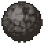
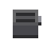
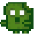
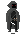
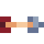
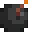
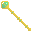
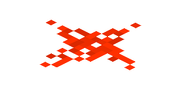
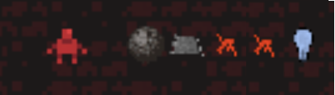

# Project: Dungeon Mania

## Contents

This specification is broken into four parts:
<ol type="i">
    <li><a href="#part-i-introduction">Introduction</li>
    <li><a href="#part-ii-product-specification">Product Specification</a></li>
    <li><a href="#part-iii-technical-specification">Technical Specification</a></li>
</ol>

### Table of Contents

[[_TOC_]]

# Part I) Introduction

## 1. Aims

* Apply software design principles and patterns to create well-maintained software solutions
* Synthesise and adapt to changes in requirements
* Practice software design and development in a dynamic team environment using Agile principles
* Work with the Java Programming Language and Java Class Libraries
* Build medium-scale persistent web applications from scratch
* Appreciate issues in the design and development of software

## 2. Overview

A new game called *Dungeon Mania*, but with a modern twist - designed as a web application.

# Part II) Product Specification

## 3. Rules of the Game

In Dungeon Mania you control a Player and have to complete various goals within a series of dungeons to complete the game!

The simplest form of such a puzzle is a maze, where the Player must find their way from the starting point to the exit.


More advanced puzzles may contain things like boulders that need to be pushed onto floor switches,


enemies that need to be fought with weapons, or collectables like potions and treasure.


### 3.1 Player

The Player, can be moved up, down, left and right into cardinally adjacent squares, provided another entity doesn't stop them (e.g. a wall). The Player begins the game with a set amount of health and attack damage. The Player spawns at a set 'entry location' at the beginning of a game.

### 3.2 Static Entities

The game contains the following static entities. 

| Entity    | Image | Description   |
| --------- | ----- | -----------   |
| Wall      |  | Blocks the movement of the Player, enemies and boulders.   |
| Exit      |  | If the Player goes through it, the puzzle is complete. |
| Boulder   |  | Acts like a wall in most cases. The only difference is that it can be pushed by the Player into cardinally adjacent squares. The Player is only strong enough to push <b>one</b> boulder at a time. When the player pushes a boulder, they move into the spot the boulder was previously in. Boulders can be pushed onto collectable entities. |
| Floor Switch |   | Switches behave like empty squares, so other entities can appear on top of them. When a boulder is pushed onto a floor switch, it is triggered. Pushing a boulder off the floor switch untriggers. |
| Door      |  | Exists in conjunction with a single key that can open it. If the Player holds the key, they can open the door by moving through it. Once open, it remains open. |
| Portal       |  | Teleports entities to a corresponding portal. The player must end up in a square cardinally adjacent to the corresponding portal. The square they teleport onto must also be within movement constraints - e.g. the player cannot teleport and end up on a wall. If all squares cardinally adjacent to the corresponding portal are walls, then the player should remain where they are. |
| Zombie Toast Spawner |  | Spawns zombie toasts in an open square cardinally adjacent to the spawner. The Player can destroy a zombie spawner if they have a weapon and are cardinally adjacent to the spawner. If all the cardinally adjacent cells to the spawner are walls, then the spawner will not spawn any zombies. |

### 3.3 Moving Entities

In addition to the Player, the game contains the following moving entities. 

All enemy entities can be created as part of the initial dungeon. Each tick, all enemies move according to their respective behaviour. 

| Entity    | Image | Description |
| --------- | ----- | ----------- |
Spider |  | Spiders spawn at random locations in the dungeon from the beginning of the game. When the spider spawns, they immediately move the 1 square upwards (towards the top of the screen) and then begin 'circling' their spawn spot (see a [visual example here](images/spider_movement_1.png)). Spiders are able to traverse through walls, doors, switches, portals, exits (which have no effect), but not boulders, in which case it will reverse direction (see a [visual example here](images/spider_movement_2.png)). When it comes to spawning spiders, since the map is technically infinite you can spawn them anywhere - however for better gameplay we suggest you make an assumption and pick a four co-ordinate box to spawn spiders in. If a spider is stuck between two boulders in its movement path, it should remain still. |
| Zombie Toast  |  | Zombies spawn at zombie spawners and move in random directions. Zombies are limited by the same movement constraints as the Player, except portals have no effect on them. |
| Mercenary |  | Mercenaries do not spawn; they are only present if created as part of the dungeon. They constantly move towards the Player, stopping only if they cannot move any closer (they are able to move around walls). Mercenaries are limited by the same movement constraints as the Player. All mercenaries are considered hostile, unless the Player can bribe them with a certain amount of gold; in which case they become allies. Mercenaries must be within a certain radius of the player in order to be bribed, which is formed by the diagonally and cardinally adjacent cells in a "square" fashion, akin to the blast radius for bombs. As an ally, once it reaches the Player it simply follows the Player around, occupying the square the player was previously in. |

### 3.3.1 Bosses 💀

Bosses are moving entities which are harder to defeat/conquer than normal enemies.

| Entity    | Image         | Description |
| --------- | --------------| ------------|
| Assassin |  | Assassins are exceptionally powerful mercenaries which deal significantly more damage. When bribing an Assassin, there is a certain chance that the bribe will fail; the gold will be wasted and the Assassin will remain hostile. Assassins are also capable of seeing and moving towards the Player when they are invisible, if they are within a certain radius.  |
| Hydra |  | Hydras are generally considered to be a special creatures similar to Zombies. Hydras are limited by the same movement constraints as Zombies. When a hydra is attacked by the player, there is a certain chance that its health will increase rather than decrease by the given amount, [as two heads have grown back when one is cut off](https://simple.wikipedia.org/wiki/Lernaean_Hydra). |

### 3.4 Collectable Entities

| Entity    | Image | Description |
| --------- | ----- | ----------- |
| Treasure       |  | Can be collected by the Player. | 
| Key            |  | Can be picked up by the player when they move into the square containing it. The Player can carry only one key at a time, and only one door has a lock that fits the key. Keys disappear once used in any context i.e. opening a door, building an item. If a key is used before opening its door, its corresponding door will be locked forever. | 
| Invincibility Potion |  | When a Player picks up an Invincibility potion, they may consume it at any time. Any battles that occur when the Player has the effects of the potion end immediately after the first round, with the Player immediately winning. Because of this, Mercenaries and Zombies will run away from the Player when they are invincible. Movement of spiders and bribed mercenaries remains unaffected. The effects of the potion only last for a limited time.         |
| Invisibility Potion | | When a player picks up an invisibility potion, they may consume it at any time and they immediately become invisible and can move past all other entities undetected. Battles do not occur when a player is under the influence of an invisibility potion. Since mercenaries typically follow the player, their movement becomes the same as a Zombie when the player is invisible. |
| Wood       |  | Can be collected by the player.  |
| Arrows     |  | Can be picked up by the player.  |
| Bomb       |  | Can be collected by the player. When removed from the inventory it is placed on the map at the player's location. When a bomb is cardinally adjacent to an active switch, it destroys all entities in diagonally and cardinally adjacent cells, except for the player, forming a "square" blast radius. The bomb should detonate when it is placed next to an already active switch, or placed next to an inactive switch that then becomes active. The bomb explodes on the same tick it becomes cardinally adjacent to an active switch. A bomb cannot be picked up once it has been used. |
| Sword  |  | A standard melee weapon. Swords can be collected by the Player and used in battles, increasing the amount of damage they deal by an additive factor. Each sword has a specific durability that dictates the number of battles it can be used before it deteriorates and is no longer usable.  |

It is possible for a player to use another potion while the effects of an existing potion are still lasting (can be of the same or a different type of potion). In this case, the effects are not registered immediately but are instead 'queued' and will take place the tick following the previous potion wearing of. For example, on tick 0 the Player consumes an invinsibility potion that lasts for 5 ticks and becomes invisible to enemies moving that tick, on tick 3 they use an invincibility potion, at the end of tick 4 (after all enemy movements) the player becomes visible again and becomes invincible.

### 3.4.1 Further Collectable Entities 💀

In Milestone 3, the following collectable entities have been added:

| Entity    | Image         | Description |
| --------- | --------------| ------------|
| Sun Stone |  | A special form of treasure, hard and treasuable. It can be picked up by the player. Can be used to open doors, and can be used interchangeably with treasure or keys when building entities. But it cannot be used to bribe mercenaries or assassins. Since it is classed as treasure it counts towards the treasure goal. When used for opening doors, or when replacing another material such as a key or treasure in building entities, it is retained after use. |

### 3.5 Buildable Entities

Some entities can be built using a 'recipe' by the player, where entities are combined to form more complex and useful entities. Once a buildable item has been constructed, it is stored in a player's inventory. For all buildable entities, once the item is constructed the materials used in that construction have been consumed and disappear from the player's inventory. 

| Entity    | Image         | Description       |
| --------- | --------------| ------------------|
| Bow  | | Can be crafted with 1 wood + 3 arrows. The bow has a durability which deteriorates after a certain number of battles. Bows give the Player double damage in each round, to simulate being able to attack an enemy at range (it can't actually attack an enemy at range). |
| Shield    |  | Can be crafted with 2 wood + (1 treasure OR 1 key). Shields decrease the effect of enemy attacks. Each shield has a specific durability that dictates the number of battles it can be used before it deteriorates. |

### 3.5.1 Further Buildable Entities 💀

In Milestone 3, the following buildable entities have been added:

| Entity    | Image         | Description |
| --------- | --------------| ------------|
| Sceptre   |  | Can be crafted with (1 wood OR 2 arrows) + (1 key OR 1 treasure) + (1 sun stone). A character with a sceptre does not need to bribe mercenaries or assassins to become allies, as they can use the sceptre to control their minds without any distance constraint. But the effects only last for a certain number of ticks. |
| Midnight Armour |  | Can be crafted with (1 sword + 1 sun stone) if there are no zombies currently in the dungeon. Midnight armour provides extra attack damage as well as protection, and it lasts forever. |

### 3.6 Battles

A battle takes place when the Player and an enemy are in the same cell at any point within a single tick. The conditions for a battle occurring are the same regardless of whether the player moves onto the same tile as the enemy, or vice versa.

A 'round' of a battle occurs as follows:

```
Player Health = Player Health - (Enemy Attack Damage / 10)
Enemy Health = Enemy Health - (Player Attack Damage / 5)
```

If the Player's health is <= 0, then the Player dies, is removed from the game and the game is over. If the enemy's health is <= 0, then the enemy dies and is removed from the game. If after the above 'round', neither the Player nor the enemy is dead, the round repeats until either the Player or enemy is dead.

In battles, allies provide an attack and defence bonus to the player.

### 3.6.1 Weapons in Battle

An example of a bow, sword and shield being used in battle is as follows:

```
player health = 10
player base attack damage = 5
bow attack damage = 2
sword attack damage = 1
shield defence = 2
enemy health = 10
enemy attack damage = 5

Battle occurs:
- Round 1   enemy health    = 10 - ((2 * (5 + 1)) / 5)  = 7.6
            player health   = 10 - ((5 - 2) / 10)       = 9.7
- Round 2   enemy health    = 7.6 - ((2 * (5 + 1)) / 5) = 5.2
            player health   = 9.7 - ((5 - 2) / 10)      = 9.4
- Round 3   ...
```

All additive/reductive bonuses from weapons are processed before multiplicative bonuses.

### 3.7 Goals

In addition to its layout, each dungeon also has a goal that defines what must be achieved by the player for the dungeon to be considered complete. Basic goals are:

* Getting to an exit;
* Destroying a certain number of enemies (or more) AND all spawners;
* Having a boulder on all floor switches;
* Collecting a certain number of treasure items (or more); 

Goals are only evaluated after the first tick. If getting to an exit is one of a conjunction of conditions, it must be done last. For example, if the condition is to destroy all enemies AND get to an exit, the player must destroy the enemies THEN get to the exit. 

#### 3.7.2 Complex Goals

More complex goals can be built by logically composing goals. For example:

* Destroying a certain number of enemies and spawners AND getting to an exit
* Collecting a certain number of treasure OR having a boulder on all floor switches
* Getting to an exit AND (destroying all enemies OR collecting all treasure)

All compound goals are binary (they contain two and only two subgoals).

If getting to an exit is one of a conjunction of conditions, it must be done last. For example, if the condition is to collect 3 treasure AND get to an exit, the player must collect at least 3 treasures THEN get to the exit. It is possible for a subgoal to become un-achieved, for example if the dungeon goal is `boulders AND exit` and all boulders are pushed onto switches, then the boulders subgoal becomes complete. However, if a boulder is then moved off a switch, the boulders subgoal is no longer complete.

### 3.8 Winning & Losing

The game is won when all the goals are achieved. The game is lost when the player dies and is removed from the map.

### 3.9 Advanced Movement 💀

During the development process the engineering team discovered issues in the requirements of the movement of mercenaries and decided that they should follow a specific path to move towards the player.

In this Milestone, the movement of mercenaries (and by extension assassins) must follow a Djikstra's algorithm to take the shortest path towards the player.

<details>
<summary>
You can view pseudocode for the algorithm here.
</summary>

> Note: This is not necessarily optimal (A* is probably a better algorithm for our common maze like dungeons), but since this is a design course and not an algorithms course, this is fine.

```
function Dijkstras(grid, source):
    let dist be a Map<Position, Double>
    let prev be a Map<Position, Position>

    for each Position p in grid:
        dist[p] := infinity
        previous[p] := null
    dist[source] := 0

    let queue be a Queue<Position> of every position in grid
    while queue is not empty:
        u := next node in queue with the smallest dist
        for each cardinal neighbour v of u:
            if dist[u] + cost(u, v) < dist[v]:
                dist[v] := dist[u] + cost(u, v)
                previous[v] := u
    return previous
```

</details>

As part of this, you will need to extend your solution to accomodate the idea of a **swamp tile**. These are tiles that have an `x` and `y` position and remain fixed throughout the entire game. They slow the movement of all entities through them, except for the player. Each swamp file has a movement factor which is a multiplying factor of the number of ticks it takes to traverse the tile. For example, let us say the movement factor for a swamp tile is 2:
* Tick 1: Move onto the swamp tile;
* Tick 2: Stuck on the swamp tile;
* Tick 3: Still stuck on the swamp tile;
* Tick 4: Move off the swamp tile.

| Entity    | Image         | 
| --------- | --------------|
| Swamp Tile |  |

Your implementation of Djikstra's will need to accomodate for the fact that swamp tiles slow the enemies down. There will be one autotest that checks that portals have an effect on your implementation of Djikstra's.

### 3.10 Persistence 💀

At any point during the game, the game should be able to be saved into a local persistence layer such that if the application is terminated, the user can reboot the application, select the game from a list of saved games and continue playing from where they left off, as if nothing had changed at all.

To pass the more basic tests, you will simply need to preserve the position of entities on the map. To pass more complex ones, you will need to consider persistence of items like potions, bribing/mind-control, etc.

### 3.11 Extension 1: Time Travel 💀

#### 3.11.1 Time Turner

This part of the extension includes the following new entity:

| Entity    | Image         |
| --------- | --------------|
| Time Turner |  |

If the player has collected a time turner, then two rewind buttons will appear on the frontend. When clicked, these buttons move the state of the game back one tick and 5 ticks respectively and "transport" the current player back to those game states in a time travelling fashion.

#### 3.11.2 Time Travelling Portal

This part of the extension includes the following new entity:

| Entity    | Image         |
| --------- | --------------|
| Time Travelling Portal |  |

If a player travels through a time travelling portal, they end up on the same square as the portal, except the dungeon state is that of 30 ticks previously. If less than 30 ticks have passed, then the dungeon state is simply the initial dungeon state.

#### 3.11.3 Time Travel Rules

When a character has time travelled, either by the rewind buttons or via a time travelling portal:

* Their 'older self' still exists in the dungeon as its own entity. If they encounter their older self and **either** are carrying a sun stone or are wearing midnight armour, or they are invisible, then nothing happens. If not, then a battle ensues.
* Their 'older self' should take the same path as was taken initially, and unless they encounter their 'current self' (they character being controlled), should eventually travel through the time portal and disappear from the map.
* The player's inventory persists across time travelling. This means that if a player picks up a sword then travels through a time portal, the sword remains in their inventory as well as being back on the map available to pick up.

Only the character can travel through time travel portals.

The older player should still collect items and play out all `tick` and `interact` movements with those items as they did before. Time travel takes the player to *after* the tick takes place, e.g. if on tick 30 the player travels through a portal it arrives out of the other side after tick 0 has taken place. Note that for time turners, this isn't the same as `rewind` operations do not class as a `tick`.

<details>
<summary>
Implementation Hint
</summary>

The design of this extension is up to you, however we recommend you treat time travel as moving backwards in a series of game states that are being stored (the state of the dungeon at tick X). When time travel occurs, the player is transported to that state, and all `tick` and `interact` functions are "played" out in the same order *for the older player*, not the current player.

This also means that when the older player reaches the tick during which they time travelled (either by using a time turner or through a portal), they should be removed from the map.

</details>

### 3.12 Extension 2: Dungeon Builder 💀

In this extension, instead of specifying an existing dungeon to play, players can choose specify a dungeon to be automatically generated when creating a new game.

As part of this, you will need to be able to automatically generate dungeons.  Furthermore it's important that you have an *exit* at the end position and that you have exit goals setup for this created dungeon.

#### 3.12.1 Generating a Dungeon - Randomized Prim's Algorithm

<details>
<summary>
You will need to generate dungeons according to the following maze generation algorithm (which is just a randomised version of Prim's).
</summary>

> Note: You should enforce a border of walls around the maze.

```
function RandomizedPrims(width, height, start, end):
    let maze be a 2D array of booleans (of size width and height) default false
    // false representing a wall and true representing empty space

    maze[start] = empty

    let options be a list of positions
    add to options all neighbours of 'start' not on boundary that are of distance 2 away and are walls

    while options is not empty:
        let next = remove random from options

        let neighbours = each neighbour of distance 2 from next not on boundary that are empty
        if neighbours is not empty:
            let neighbour = random from neighbours
            maze[ next ] = empty (i.e. true)
            maze[ position inbetween next and neighbour ] = empty (i.e. true)
            maze[ neighbour ] = empty (i.e. true)

        add to options all neighbours of 'next' not on boundary that are of distance 2 away and are walls
    
    // at the end there is still a case where our end position isn't connected to the map
    // we don't necessarily need this, you can just keep randomly generating maps (was original intention)
    // but this will make it consistently have a pathway between the two.
    if maze[end] is a wall:
        maze[end] = empty

        let neighbours = neighbours not on boundary of distance 1 from maze[end]
        if there are no cells in neighbours that are empty:
            // let's connect it to the grid
            let neighbour = random from neighbours
            maze[neighbour] = empty
```

Or, in a more wordy fashion;

- Given a grid that consists of a 2D array of states (Wall/Empty) initialised to only walls
- Set the start position to empty spaces
- Add to a list of positions to process the neighbours of start (that are walls)
- Given that there are still positions to process:
    - Pick a random position from the list and a random cardinal neighbour of distance 2 that isn't on the boundary and is empty (not a wall)
    - Pick a random neighbour that is a wall and connect the two via 2 empty spaces
    - Compute all cardinal positions that are walls for the random neighbour and add it to the list of positions to process.
- At the end fix-up the maze given that the end cell is still a wall
    - Mark it as not a wall
    - If it has atleast one neighbour that is a empty cell then don't do anything else (it's connected)
    - Otherwise, mark one of it's cardinal neighbours as a empty cell as well.
</details>

### 3.13 Extension 3: Logic Switches 💀

There are two new entities in this extension:

| Entity      | Image                                                       | Description                                                                                                                                                           |
|-------------|-------------------------------------------------------------|-----------------------------------------------------------------------------------------------------------------------------------------------------------------------|
| Light Bulb  |                           | Light bulbs cannot be collected, but can be lit up by placing a boulder on an cardinally adjacent switch. Light bulbs will always be created off.                               |
| Wire        |         | Wires cannot be collected, but form part of a circuit and are connected to a switch and any entity that interacts via switches.                                       |
| Switch Door |  | Switch doors can be opened without a key if connected to an active switch/circuit. It should only remain open as long as it is connected to an active switch/circuit. |

All entities which interact via switches (doors, bombs, and light bulbs), as well as switches themselves can become "logical" entities, where one of the following rules is adopted:

* AND - the entity will be only activated if there are 2 or more cardinally adjacent activated entities (switches with boulders on them or active wires). If there are more than two switches adjacent, all must be activated.
* OR - the entity will be activated if there are 1 or more cardinally adjacent activated entities
* XOR - the entity will be activated if there is 1 and only 1 cardinally adjacent activated entity
* CO_AND - the entity will only be activated if there are 2 or more activated entities cardinally adjacent, which are **both activated on the same tick** (i.e. a boulder is pushed onto them at the same time).

If a switch cardinally adjacent to a wire is activated, all the other interactable entities cardinally adjacent to the wire are activated. This allows for the creation of dungeons with logic gates. For example:

<table>
<tr>
<td>

</td>
<td>

</td>
</tr>
</table>

# Part III) Technical Specification

[You can find setting up instructions here](SETUP.md).

## 4. Dungeon Maps

Dungeon maps consist of JSON files which contain the following:
* `entities`, an array of entities in the map when the game starts; and
* `goal-condition`, a specification of the goals for winning the dungeon.

There will be no other fields present in the JSON.

All maps are infinite in all directions. Moving left/right is a decrease/increase in the x co-ordinate of an entity respectively, moving up/down is a decrease/increase in the y co-ordinate of an entity respectively.

### 4.1 Input Specification - Entities

Each entry in the `entities` JSON Array will be a JSON Object with the following fields:
* `x` - the x-position of the entity in the dungeon when the game starts;
* `y` - the y-position of the entity in the dungeon when the game starts; and
* `type` - the type of the entity.

The `type` field will be a string that starts with one of the following prefixes. For automarking purposes, all entities passed in will have a type in the following table. 

| Entity | JSON Prefix | Creatable in Dungeon Map? |
| ------ | ----------- | ------------------------- |
| Player    | <code>player</code> | Yes |
| Wall      | <code>wall</code> | Yes |
| Exit      | <code>exit</code> | Yes |
| Boulder   | <code>boulder</code> | Yes |
| Floor Switch | <code>switch</code> | Yes |
| Door      | <code>door</code> | Yes | 
| Portal       | <code>portal</code> | Yes |
| Zombie Toast Spawner | <code>zombie_toast_spawner</code> | Yes |
| Spider    | <code>spider</code>   | Yes |
| Zombie Toast | <code>zombie_toast</code>   | Yes |
| Mercenary | <code>mercenary</code> | Yes |
| Treasure      | <code>treasure</code> | Yes |
| Key           | <code>key</code> | Yes |
| Invincibility Potion | <code>invincibility_potion</code> | Yes |
| Invisibility Potion | <code>invisibility_potion</code> | Yes |
| Wood      | <code>wood</code> | Yes |
| Arrows    | <code>arrow</code> | Yes |
| Bomb      | <code>bomb</code> | Yes |
| Sword | <code>sword</code> | Yes |
| Bow  | <code>bow</code> | No, since this entity must be built by the player. |
| Shield    | <code>shield</code> | No, since this entity must be built by the player. |

#### 4.1.1 Further Entities 💀

| Entity | JSON Prefix | Creatable in Dungeon Map? |
| ------ | ----------- | ------------------------- |
| Assassin | <code>assassin</code> | Yes |
| Hydra | <code>hydra</code> | Yes |
| Swamp Tile    | <code>swamp_tile</code> | Yes |
| Sun Stone    | <code>sun_stone</code> | Yes |
| Sceptre    | <code>sceptre</code> | No, since this entity must be built by the player. |
| Midnight Armour    | <code>midnight_armour</code> | No, since this entity must be built by the player. |
| Time Turner    | <code>time_turner</code> | Yes |
| Time Travelling Portal    | <code>time_travelling_portal</code> | Yes |
| Light Bulb (off)    | <code>light_bulb_off</code> | Yes |
| Light Bulb (on)    | <code>light_bulb_on</code> | No, since light bulbs will always be created off. |
| Wire    | <code>wire</code> | Yes |
| Switch Door    | <code>switch_door</code> | Yes |
| Older Player    | <code>older_player</code> | No, since these will only appear when the player has time travelled. |
